# P3-T01 — Pipeline Orchestrator: Plan

## Overview

Create a single exported async function `runPipeline(companyToken, emit)` that orchestrates all five pipeline stages in sequence, emits `PipelineEvent` objects at each stage boundary and per job, runs dedup between Stage 2 and Stage 3, persists the run on completion, and marks all scored jobs as processed.

**Files to create:**
- [`server/src/pipeline/orchestrator.ts`](server/src/pipeline/orchestrator.ts) (new)
- [`server/src/pipeline/orchestrator.test.ts`](server/src/pipeline/orchestrator.test.ts) (new)

**File to modify:**
- [`server/src/types/index.ts`](server/src/types/index.ts) — add `PipelineEvent` union type and `EmitCallback`

**Exit criterion:** `npm test --workspace=server -- --testPathPattern=orchestrator` exits 0.

---

## Task flow diagram

```mermaid
flowchart TD
    A["runPipeline(companyToken, emit)"] --> B["loadCompanyConfig(companyToken)"]
    A --> C["loadSkillsProfile()"]
    B --> D["Build FilterConfig from CompanyConfig\n(departments only; location='', keyword='')"]
    C --> D
    D --> E["Emit stage-start {stage:1, label:'Fetch jobs'}"]
    E --> F["fetchJobs(companyToken)"]
    F --> G["Emit job-passed {stage:1} per job"]
    G --> H["Emit stage-complete {stage:1}"]
    H --> I["Emit stage-start {stage:2, label:'Metadata filter'}"]
    I --> J["filterJobs(rawJobs, filterConfig)"]
    J -- "ConfigMismatchError" --> K["Emit run-error {stage:2,\nerror: ConfigMismatchError.message}"]
    K --> L["Rethrow ConfigMismatchError"]
    J -- "success" --> M["Emit job-passed/job-rejected {stage:2} per job"]
    M --> N["Emit stage-complete {stage:2}"]
    N --> O["Dedup: isProcessed(job.id) per FilteredJob"]
    O --> P["Emit job-rejected {stage:3, reason:'Already processed'} for dupes"]
    P --> Q["Emit stage-start {stage:3, label:'Extract requirements'}"]
    Q --> R["extractJobs(remaining, companyConfig, companyConfig.name)"]
    R --> S["Emit job-passed/job-rejected {stage:3} per job"]
    S --> T["Emit stage-complete {stage:3, report:{...}}"]
    T --> U["Emit stage-start {stage:4, label:'Gap filter'}"]
    U --> V["filterByGap(extractedJobs, skillsProfile)"]
    V --> W["Emit job-passed/job-rejected {stage:4} per job"]
    W --> X["Emit stage-complete {stage:4}"]
    X --> Y["Emit stage-start {stage:5, label:'Score jobs'}"]
    Y --> Z["scoreJobs(gatedJobs, skillsProfile)"]
    Z --> AA["Emit job-passed/job-rejected {stage:5} per job"]
    AA --> AB["Emit stage-complete {stage:5}"]
    AB --> AC["Compute ReportCard from 5 stage reports"]
    AC --> AD["markProcessed(job.id) per ScoredJob"]
    AD --> AE["Build PipelineRunOutput"]
    AE --> AF["persistRun(pipelineRunOutput)"]
    AF --> AG["Emit run-complete {reportCard}"]
    AG --> AH["Return PipelineRunOutput"]
```



---

## Phase A — Add event types to shared types

**File:** [`server/src/types/index.ts`](server/src/types/index.ts)

**What:** Append these new types after the existing `PipelineRunOutput` interface.

```typescript
// ---------------------------------------------------------------------------
// Pipeline event types (consumed by SSE routes and React hook)
// ---------------------------------------------------------------------------

export interface StageStartEvent {
  type: 'stage-start';
  stage: StageNumber;
  label: string;
}

export interface StageCompleteEvent {
  type: 'stage-complete';
  stage: StageNumber;
  report: StageReport;
}

export interface JobPassedEvent {
  type: 'job-passed';
  stage: StageNumber;
  job: {
    id: number;
    title: string;
    url: string;
  };
}

export interface JobRejectedEvent {
  type: 'job-rejected';
  stage: StageNumber;
  job: RejectedJob;
}

export interface RunErrorEvent {
  type: 'run-error';
  stage: StageNumber;
  error: string;
}

export interface RunCompleteEvent {
  type: 'run-complete';
  reportCard: ReportCard;
}

/** Discriminated union of all events emitted by runPipeline. */
export type PipelineEvent =
  | StageStartEvent
  | StageCompleteEvent
  | JobPassedEvent
  | JobRejectedEvent
  | RunErrorEvent
  | RunCompleteEvent;

/** Callback signature for the orchestrator's emit parameter. */
export type EmitCallback = (event: PipelineEvent) => void;
```

**Why separate interfaces vs. inline:** Each event has a distinct shape. Named interfaces make it easy for downstream consumers (SSE serializer, React hook) to narrow on `event.type` and access type-specific fields.

---

## Phase B — Implement orchestrator.ts

**File:** [`server/src/pipeline/orchestrator.ts`](server/src/pipeline/orchestrator.ts)

### Imports

| Symbol | Source |
|--------|--------|
| `fetchJobs` | `./stage1-fetch` |
| `filterJobs`, `ConfigMismatchError` | `./stage2-filter` |
| `extractJobs` | `./stage3-extractor` |
| `filterByGap` | `./stage4-gap-filter` |
| `scoreJobs` | `./stage5-scorer` |
| `isProcessed`, `markProcessed` | `../output/dedupCache` |
| `persistRun` | `../output/runPersister` |
| `loadCompanyConfig` | `../config/companyConfig` |
| `loadSkillsProfile` | `../config/skillsProfile` |
| Types (`PipelineRunOutput`, `ReportCard`, `StageReport`, `PipelineEvent`, `EmitCallback`, `FilterConfig`, `FilteredJob`, `ExtractedJob`, `GatedJob`, `ScoredJob`, `StageResult`, `Stage3Result`, `Stage5Result`, `RunStatus`, `RejectedJob`, `StageNumber`) | `../types` |
| Types (`CompanyConfig`, `SkillsProfile`) | `../config/types` |

### Function signature

```typescript
export async function runPipeline(
  companyToken: string,
  emit: EmitCallback,
): Promise<PipelineRunOutput>
```

### Internal algorithm (pseudocode)

```
1. LOAD configs:
   - companyConfig = loadCompanyConfig(companyToken)
   - skillsProfile = loadSkillsProfile()

2. BUILD filterConfig:
   - FilterConfig { location: '', departments: companyConfig.departments, keyword: '' }
   NOTE: location and keyword default to empty strings, which causes the
   corresponding filters in filterJobs to be skipped (the code checks length > 0).

3. INITIALIZE stageReports: StageReport[] = [] (accumulator)
   INITIALIZE allRejectedJobs: RejectedJob[] = [] (accumulator for PipelineRunOutput)
   INITIALIZE totalRuntimeMs: number (start Date.now())

4. STAGE 1 — Fetch
   - emit({ type: 'stage-start', stage: 1, label: 'Fetch jobs' })
   - { jobs: rawJobs, rawCount } = await fetchJobs(companyToken)
   - for each job in rawJobs:
       emit({ type: 'job-passed', stage: 1, job: { id, title, url: absolute_url } })
   - stageReport1: StageReport = { stage: 1, passedCount: rawCount, rejectedCount: 0 }
   - stageReports.push(stageReport1)
   - emit({ type: 'stage-complete', stage: 1, report: stageReport1 })

5. STAGE 2 — Filter
   - emit({ type: 'stage-start', stage: 2, label: 'Metadata filter' })
   - TRY:
       result2 = filterJobs(rawJobs, filterConfig)
     CATCH ConfigMismatchError:
       emit({ type: 'run-error', stage: 2, error: error.message })
       throw error  (rethrow)
   - for each job in result2.passed:
       emit({ type: 'job-passed', stage: 2, job: { id, title, url } })
   - for each job in result2.rejected:
       emit({ type: 'job-rejected', stage: 2, job })
       allRejectedJobs.push(job)
   - stageReport2: StageReport = { stage: 2, passedCount: result2.passed.length, rejectedCount: result2.rejected.length }
   - stageReports.push(stageReport2)
   - emit({ type: 'stage-complete', stage: 2, report: stageReport2 })

6. DEDUP CHECK (between Stage 2 and Stage 3)
   - dedupFiltered: FilteredJob[] = []
   - for each job in result2.passed:
       if isProcessed(job.id):
         rejectedJob: RejectedJob = { id: job.id, title: job.title, url: job.url, rejectedAtStage: 3, reason: 'Already processed' }
         emit({ type: 'job-rejected', stage: 3, job: rejectedJob })
         allRejectedJobs.push(rejectedJob)
       else:
         dedupFiltered.push(job)
   - (Note: dedup uses stage=3 in job-rejected events per spec, but no stage-start/complete events for dedup itself)

7. STAGE 3 — Extract
   - emit({ type: 'stage-start', stage: 3, label: 'Extract requirements' })
   - result3: Stage3Result = await extractJobs(dedupFiltered, companyConfig, companyConfig.name)
   - for each job in result3.passed:
       emit({ type: 'job-passed', stage: 3, job: { id: job.id, title: job.title, url: job.url } })
   - for each job in result3.rejected:
       emit({ type: 'job-rejected', stage: 3, job })
       allRejectedJobs.push(job)
   - stageReport3: StageReport = { stage: 3, passedCount: result3.passed.length, rejectedCount: result3.rejected.length }
   - stageReports.push(stageReport3)
   - emit({ type: 'stage-complete', stage: 3, report: stageReport3 })

8. STAGE 4 — Gap filter
   - emit({ type: 'stage-start', stage: 4, label: 'Gap filter' })
   - result4: StageResult<GatedJob> = filterByGap(result3.passed, skillsProfile)
   - for each job in result4.passed:
       emit({ type: 'job-passed', stage: 4, job: { id: job.id, title: job.title, url: job.url } })
   - for each job in result4.rejected:
       emit({ type: 'job-rejected', stage: 4, job })
       allRejectedJobs.push(job)
   - stageReport4: StageReport = { stage: 4, passedCount: result4.passed.length, rejectedCount: result4.rejected.length }
   - stageReports.push(stageReport4)
   - emit({ type: 'stage-complete', stage: 4, report: stageReport4 })

9. STAGE 5 — Score
   - emit({ type: 'stage-start', stage: 5, label: 'Score jobs' })
   - result5: Stage5Result = await scoreJobs(result4.passed, skillsProfile)
   - for each job in result5.scoredJobs:
       emit({ type: 'job-passed', stage: 5, job: { id: job.id, title: job.title, url: job.url } })
   - for each job in result5.rejected:
       emit({ type: 'job-rejected', stage: 5, job })
       allRejectedJobs.push(job)
   - stageReport5: StageReport = { stage: 5, passedCount: result5.scoredJobs.length, rejectedCount: result5.rejected.length }
   - stageReports.push(stageReport5)
   - emit({ type: 'stage-complete', stage: 5, report: stageReport5 })

10. COMPUTE ReportCard
    - totalRuntimeMs = Date.now() - startTime
    - totalPassed = sum of all stageReport.passedCount
    - totalRejected = sum of all stageReport.rejectedCount
    - estimatedCostUsd = (result3.stats?.estimatedCostUsd ?? 0) + (result5.stats?.estimatedCostUsd ?? 0)
    - reportCard: ReportCard = { stages: stageReports, totalPassed, totalRejected, totalRuntimeMs, estimatedCostUsd }

11. MARK PROCESSED
    - for each job in result5.scoredJobs:
        markProcessed(job.id)

12. BUILD PipelineRunOutput
    - output: PipelineRunOutput = {
        companyToken,
        runAt: new Date().toISOString(),
        status: 'complete',
        reportCard,
        scoredJobs: result5.scoredJobs,
        rejectedJobs: allRejectedJobs,
      }

13. PERSIST
    - persistRun(output)

14. EMIT run-complete
    - emit({ type: 'run-complete', reportCard })

15. RETURN output
```

### Key design decisions

1. **Stage 1 doesn't reject jobs** — `fetchJobs` returns all jobs as passed. All jobs get `job-passed` for stage 1. There are no `job-rejected` for stage 1.

2. **ConfigMismatchError handling** — Caught specifically around the `filterJobs` call. Emits `run-error` with stage=2 and the error message, then rethrows. This matches the spec: "On ConfigMismatchError from Stage 2: emits run-error event and rethrows."

3. **Dedup uses stage 3 in rejection events** — Per spec: "deduplicated jobs emit as job-rejected with rejectedAtStage: 3 and reason Already processed." Dedup is NOT wrapped in stage-start/stage-complete events — it's a silent step between stages 2 and 3.

4. **FilterConfig construction** — `location` and `keyword` are set to empty strings (filters are skipped). Only `departments` from the company config is used. This is because `CompanyConfig` doesn't have `location` or `keyword` fields. If those are added later, this is the place to wire them in.

5. **Cost estimation** — Only Stage 3 and Stage 5 use LLM calls, so `estimatedCostUsd` sums `result3.stats.estimatedCostUsd` and `result5.stats.estimatedCostUsd`.

6. **No business logic in orchestrator** — It only calls stage functions, collects results, and relays via `emit`. All filtering/extraction/scoring logic lives in the stage modules.

---

## Phase C — Write orchestrator.test.ts

**File:** [`server/src/pipeline/orchestrator.test.ts`](server/src/pipeline/orchestrator.test.ts)

### Mock strategy

All stage functions, config loaders, dedup cache, and persister must be mocked. No real stage logic runs in tests (per spec: "All stage functions must be mocked in orchestrator tests").

| Module to mock | What to mock |
|----------------|-------------|
| `./stage1-fetch` | `fetchJobs` — return `{ jobs: [mockRawJob], rawCount: 1 }` |
| `./stage2-filter` | `filterJobs` — return `StageResult<FilteredJob>`; or throw `ConfigMismatchError` |
| `./stage3-extractor` | `extractJobs` — return `Stage3Result` with passed/rejected/stats |
| `./stage4-gap-filter` | `filterByGap` — return `StageResult<GatedJob>` |
| `./stage5-scorer` | `scoreJobs` — return `Stage5Result` with scoredJobs/rejected/stats |
| `../output/dedupCache` | `isProcessed` — return true/false; `markProcessed` — noop |
| `../output/runPersister` | `persistRun` — return filepath string |
| `../config/companyConfig` | `loadCompanyConfig` — return mock `CompanyConfig` |
| `../config/skillsProfile` | `loadSkillsProfile` — return mock `SkillsProfile` |

### Shared test setup

- A reusable `emitSpy` function (e.g., a Jest mock function) to capture emitted events.
- Mock raw job, filtered job, extracted job, gated job, scored job fixtures inline or from shared helpers.
- `beforeEach` / `afterEach` to clear mock state.

### 8 named test cases

| # | Test case | What it verifies |
|---|-----------|------------------|
| 1 | **stages called in order 1→2→3→4→5** | Spy on each stage function. Confirm `fetchJobs` called first, then `filterJobs`, then `extractJobs`, then `filterByGap`, then `scoreJobs`. |
| 2 | **stage-start and stage-complete emitted per stage** | Filter emitted events for `type: 'stage-start'` and `type: 'stage-complete'`. Expect 5 start + 5 complete = 10 events. Each has correct stage number. |
| 3 | **job-passed events emitted** | After all 5 stages, confirm `job-passed` events exist for stages 1–5 with correct job IDs and URLs. |
| 4 | **job-rejected events emitted** | After stage 2 (and 3, 5), confirm `job-rejected` events exist with correct `rejectedAtStage` and `reason`. |
| 5 | **dedup skips processed jobs** | Set `isProcessed` to return `true` for one job and `false` for another. Verify the processed job is NOT passed to `extractJobs` and that a `job-rejected` event is emitted with `rejectedAtStage: 3` and reason `"Already processed"`. |
| 6 | **run-complete emits ReportCard** | After successful run, confirm final event is `type: 'run-complete'` and `reportCard` is a valid `ReportCard` with `stages` array of length 5, correct `totalPassed`, `totalRejected`, `totalRuntimeMs >= 0`, `estimatedCostUsd >= 0`. |
| 7 | **ConfigMismatchError emits run-error** | Make `filterJobs` throw `ConfigMismatchError`. Verify `run-error` event is emitted with stage=2 and the error message, and that the promise rejects. |
| 8 | **persistRun called on completion** | After successful pipeline run, confirm `persistRun` was called exactly once with a `PipelineRunOutput` matching expected shape. |

### Edge cases to consider within tests

- Stage 3 and Stage 5 reject some jobs — verify both `job-passed` and `job-rejected` events are emitted within the same stage.
- `isProcessed` returns false for all jobs (normal flow) — verify dedup doesn't remove any jobs.
- Dedup filtering removes ALL jobs — `extractJobs` receives empty array, the pipeline continues with empty arrays through stages 4 and 5.

---

## Implementation order

1. **Modify [`server/src/types/index.ts`](server/src/types/index.ts)** — Add PipelineEvent types and EmitCallback.
2. **Run `npm run build --workspace=server`** — Verify types compile cleanly.
3. **Write [`server/src/pipeline/orchestrator.test.ts`](server/src/pipeline/orchestrator.test.ts)** — Write all 8 test cases first (test-first approach per Rule 14, but note Rule 14 says test-first is mandatory for Phase 2 tasks; for P3-T01 the task says "test suite covers" but doesn't explicitly mandate test-first. However, to maintain quality, write tests first.)
4. **Run `npm test --workspace=server -- --testPathPattern=orchestrator`** — Confirm tests fail (red).
5. **Implement [`server/src/pipeline/orchestrator.ts`](server/src/pipeline/orchestrator.ts)** — Implement the orchestrator function.
6. **Run tests again** — Confirm all 8 tests pass (green).
7. **Update [`SESSIONSTATE.md`](SESSIONSTATE.md)** — Mark P3-T01 as complete, move to P3-T02 Up next.

---

## Questions / open items for the user

1. **CompanyConfig vs FilterConfig mismatch:** `CompanyConfig` has no `location` or `keyword` fields, but `FilterConfig` requires them. The plan defaults both to empty strings (which skips those filters). Is this acceptable, or should `location` and `keyword` be added to the company config schema?
2. **Stage 1 events:** Since `fetchJobs` returns all jobs as passed (no rejected), the plan emits `job-passed` for every raw job at stage 1. Is this the expected behavior?
