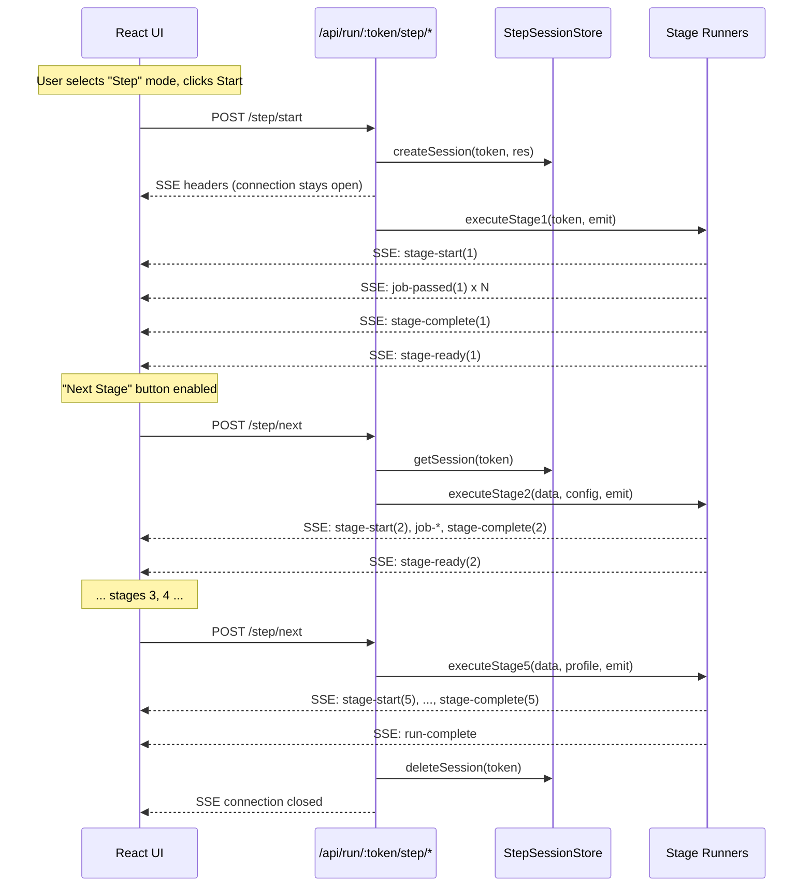

# P4-T06 · Step Mode & Server-Side Logging

**Status:** Planning
**Complexity:** high
**What:** Two features: (1) A "Step" mode alongside the existing "Run All" mode that lets the user manually advance the pipeline stage-by-stage via UI buttons. (2) Structured server-side logging with timestamps, stage info, and input/output summaries visible in the terminal.

**Prerequisite:** P4-T05 (Config Editor) complete.
**Hard deps:** P4-T05
**Files:** Multiple — see task breakdown below.

---

## Feature 1: Step-by-Step Mode

### Architecture

The SSE protocol is unidirectional (server → client). For step mode, the client needs to signal "advance to next stage" back to the server. This requires two communication channels:

1. **SSE stream** — long-lived connection opened by `step/start`, stays open for the entire step session. All pipeline events (`stage-start`, `job-passed`, `job-rejected`, `stage-complete`, `stage-ready`, `run-complete`) stream through this channel.
2. **HTTP POST endpoints** — separate short-lived requests that the client sends to trigger advancement (`step/next`) or cancellation (`step/cancel`).



### Server Components

#### New module: `server/src/pipeline/stepOrchestrator.ts`

```typescript
interface StepSession {
  token: string;
  res: Response;            // SSE response object
  currentStage: number;     // last completed stage (0 = not started)
  companyConfig: CompanyConfig;
  skillsProfile: SkillsProfile;
  filterConfig: FilterConfig;
  rawJobs: RawJob[];
  stage2Result?: StageResult<FilteredJob>;
  dedupFiltered: FilteredJob[];
  stage3Result?: Stage3Result;
  stage4Result?: StageResult<GatedJob>;
  stage5Result?: Stage5Result;
  allRejectedJobs: RejectedJob[];
  stageReports: StageReport[];
  startTime: number;
  finished: boolean;
}

// In-memory store (one session per company token at a time)
const sessions = new Map<string, StepSession>();

export function createStepSession(token: string, res: Response, emit: EmitCallback): void;
export async function advanceStepSession(token: string): Promise<void>;
export function cancelStepSession(token: string): void;
export function getStepSession(token: string): StepSession | undefined;
```

#### Refactored: `server/src/pipeline/orchestrator.ts`

Extract per-stage runner functions so both `runPipeline` (Run All) and `stepOrchestrator` (Step) share the same stage execution logic:

```typescript
// New exports — each runs ONE stage with event emission
export async function executeStage1(token: string, emit: EmitCallback): Promise<{ jobs: RawJob[]; rawCount: number; report: StageReport }>;
export async function executeStage2(jobs: RawJob[], config: FilterConfig, emit: EmitCallback): Promise<{ result: StageResult<FilteredJob>; report: StageReport }>;
export async function executeDedupCheck(jobs: FilteredJob[], emit: EmitCallback): Promise<FilteredJob[]>;
export async function executeStage3(jobs: FilteredJob[], config: CompanyConfig, emit: EmitCallback): Promise<{ result: Stage3Result; report: StageReport }>;
export async function executeStage4(jobs: ExtractedJob[], profile: SkillsProfile, emit: EmitCallback): Promise<{ result: StageResult<GatedJob>; report: StageReport }>;
export async function executeStage5(jobs: GatedJob[], profile: SkillsProfile, emit: EmitCallback): Promise<{ result: Stage5Result; report: StageReport }>;

// Existing — unchanged public API
export async function runPipeline(token: string, emit: EmitCallback): Promise<PipelineRunOutput>;
```

`runPipeline` is refactored to call these extracted functions internally (no behavior change).

#### New routes in `server/src/routes/pipeline.ts`

Three new endpoints added alongside the existing `GET/POST /api/run/:token`:

| Method | Path | Purpose |
|--------|------|---------|
| `POST` | `/api/run/:token/step/start` | Initialize step session, run Stage 1, keep SSE open |
| `POST` | `/api/run/:token/step/next` | Advance to next stage in the active step session |
| `POST` | `/api/run/:token/step/cancel` | Cancel step session, close SSE, clean up |

#### New event types in `server/src/types/index.ts`

```typescript
/** Emitted when a step-mode stage completes and the orchestrator is waiting for the user. */
export interface StageReadyEvent {
  type: 'stage-ready';
  stage: StageNumber;
  /** Which stage will run next (null if this was the last stage). */
  nextStage: StageNumber | null;
}

// Added to PipelineEvent union
export type PipelineEvent =
  | StageStartEvent
  | StageCompleteEvent
  | JobPassedEvent
  | JobRejectedEvent
  | RunErrorEvent
  | RunCompleteEvent
  | StageReadyEvent;  // NEW
```

### Client Components

#### Updated: `client/src/types/events.ts`

- Mirror the new `StageReadyEvent` type from the server.
- Add `RunMode` type: `'all' | 'step'`.

#### Updated: `client/src/hooks/usePipelineStream.ts`

New exports and behavior:

```typescript
export type RunMode = 'all' | 'step';

export interface UsePipelineStreamReturn {
  state: PipelineState;
  /** Run all stages (existing behavior). */
  start: () => void;
  /** Start a step-mode session (runs Stage 1, then pauses). */
  startStep: () => void;
  /** Advance to the next stage in step mode. */
  nextStage: () => void;
  /** Cancel the step session. */
  cancelStep: () => void;
  /** Close connection and reset state. */
  reset: () => void;
}
```

- `startStep()` opens EventSource to `/api/run/:token/step/start`.
- `nextStage()` sends `POST /api/run/:token/step/next` (fire-and-forget; events arrive on the existing SSE connection).
- `cancelStep()` sends `POST /api/run/:token/step/cancel` then resets.
- The hook tracks `runMode` internally.
- On `stage-ready` event: set `status` to a new value like `'awaiting_input'` so the UI knows to show "Next Stage".
- On `run-complete` or `run-error`: set terminal status, close EventSource.

#### Updated: `client/src/components/RunControls.tsx`

New UI elements:

- **Mode toggle**: Two radio buttons or a toggle switch — "Run All" | "Step". Default: "Run All".
- **Step mode buttons**:
  - When `status === 'idle'` and `mode === 'step'`: Show "Start" button (triggers `onStartStep`).
  - When `status === 'awaiting_input'`: Show "Next Stage (N)" button (triggers `onNextStage`), plus a "Cancel" button.
  - When `status === 'running'` (Run All mode): Existing behavior — Run button disabled.
  - When terminal (`complete` | `error`): Show "Reset" button.

New props:
```typescript
interface RunControlsProps {
  // ... existing props ...
  runMode: 'all' | 'step';
  onRunModeChange: (mode: 'all' | 'step') => void;
  onStartStep?: () => void;
  onNextStage?: () => void;
  onCancelStep?: () => void;
  /** Which stage will run when "Next Stage" is clicked. */
  nextStage?: number;
}
```

#### Updated: `client/src/App.tsx`

- Add `runMode` state + `setRunMode`.
- Wire new callbacks: `handleStartStep`, `handleNextStage`, `handleCancelStep`.
- Pass new props to `RunControls`.
- Pipe the new hook methods through.

---

## Feature 2: Server-Side Logging

### New module: `server/src/utils/logger.ts`

A lightweight structured logger that writes to stdout. No external dependencies.

```typescript
export interface Logger {
  /** Log a stage start with input count. */
  stageStart(stage: number, label: string, detail?: Record<string, unknown>): void;

  /** Log a stage completion with pass/reject counts. */
  stageComplete(stage: number, passed: number, rejected: number, detail?: Record<string, unknown>): void;

  /** Log a per-job event. */
  jobEvent(stage: number, eventType: 'passed' | 'rejected', jobId: number, reason?: string): void;

  /** Log an error. */
  error(stage: number, err: Error, context?: Record<string, unknown>): void;

  /** Log a general info message. */
  info(message: string, detail?: Record<string, unknown>): void;

  /** Log a warning. */
  warn(message: string, detail?: Record<string, unknown>): void;
}

export function createLogger(): Logger;
```

**Output format:**

```
[2026-06-27T00:05:14.058Z] [STAGE 1] START  | Fetch jobs | token=figma
[2026-06-27T00:05:15.123Z] [STAGE 1] JOB    | passed #48291 | "Senior Designer"
[2026-06-27T00:05:15.456Z] [STAGE 1] END    | passed=42 rejected=0 | duration=1331ms
[2026-06-27T00:05:15.460Z] [STAGE 2] START  | Metadata filter | input=42 | location="" depts=[Engineering,Design] keyword=""
[2026-06-27T00:05:15.462Z] [STAGE 2] JOB    | rejected #48292 | "Office Manager" | reason=Rejected by department filter...
[2026-06-27T00:05:15.465Z] [STAGE 2] END    | passed=15 rejected=27 | duration=5ms
[2026-06-27T00:05:15.470Z] [STAGE 3] START  | Extract requirements | input=15
[2026-06-27T00:05:18.200Z] [STAGE 3] JOB    | passed #48291 | heuristic
[2026-06-27T00:05:20.500Z] [STAGE 3] JOB    | passed #48293 | llm_fallback | tokens=342 cost=$0.0005
[2026-06-27T00:05:25.100Z] [STAGE 3] END    | passed=14 rejected=1 | heuristic=10 llm=4 tokens=1368 cost=$0.0021 | duration=9625ms
[2026-06-27T00:05:25.105Z] [STAGE 4] START  | Gap filter | input=14 | threshold=0.3
[2026-06-27T00:05:25.108Z] [STAGE 4] JOB    | rejected #48295 | gap=0.67 | unmatched=[Kubernetes,Terraform]
[2026-06-27T00:05:25.110Z] [STAGE 4] END    | passed=9 rejected=5 | duration=5ms
[2026-06-27T00:05:25.115Z] [STAGE 5] START  | Score jobs | input=9
[2026-06-27T00:05:35.200Z] [STAGE 5] JOB    | passed #48291 | score=8
[2026-06-27T00:05:45.300Z] [STAGE 5] END    | passed=9 rejected=0 | tokens=5400 cost=$0.0081 | duration=20180ms
[2026-06-27T00:05:45.305Z] [INFO]   RUN    | complete | total_passed=89 total_rejected=33 | runtime=31201ms | cost=$0.0102
```

### Integration points

The logger is instantiated once (in `orchestrator.ts` and `stepOrchestrator.ts`) and called at every stage boundary, per-job event, and error. Stage modules themselves do NOT log — logging is an orchestrator-level concern (keeps stages pure/testable).

---

## Task Breakdown

### T1 · Logger Utility
**Files:** `server/src/utils/logger.ts` (new), `server/src/utils/logger.test.ts` (new)
**What:** Create the structured logging utility as specified above.
**Tests:** Verify output format includes ISO timestamp, stage number, correct labels.
**Exit:** `npm test --workspace=server -- --testPathPattern=logger` clean.

### T2 · Add Logging to Orchestrator
**Files:** `server/src/pipeline/orchestrator.ts`
**What:** Add `logger.stageStart()`, `logger.stageComplete()`, `logger.jobEvent()`, `logger.error()`, `logger.info()` calls at every stage boundary, per-job event, and error path in `runPipeline`. Also log config load, dedup check, and run completion.
**Exit:** Manual verification — run the server and confirm structured log output appears in terminal.

### T3 · Refactor Orchestrator — Extract Stage Runners
**Files:** `server/src/pipeline/orchestrator.ts`
**What:** Extract the body of each stage from `runPipeline` into standalone exported async functions: `executeStage1`, `executeStage2`, `executeDedupCheck`, `executeStage3`, `executeStage4`, `executeStage5`. Each handles its own event emission and report building. `runPipeline` is refactored to call these in sequence (zero behavior change). The existing `runPipeline` public API signature is unchanged.
**Exit:** `npm test --workspace=server -- --testPathPattern=orchestrator` clean (all 8 existing tests pass).

### T4 · Step Orchestrator
**Files:** `server/src/pipeline/stepOrchestrator.ts` (new), `server/src/pipeline/stepOrchestrator.test.ts` (new)
**What:** Implement the `StepSession` store and `createStepSession`/`advanceStepSession`/`cancelStepSession` functions. Each calls the appropriate `executeStage*` function from the refactored orchestrator. The session is keyed by company token. Only one session per token at a time; starting a new session for the same token cancels the old one.
**Tests:** Create session, advance through stages 1→5, cancel mid-run, starting duplicate cancels old.
**Exit:** `npm test --workspace=server -- --testPathPattern=stepOrchestrator` clean.

### T5 · Step-Mode Routes
**Files:** `server/src/routes/pipeline.ts`, `server/src/types/index.ts`
**What:** Add three new routes (`step/start`, `step/next`, `step/cancel`) to the pipeline router. Add `StageReadyEvent` to the types. The `step/start` route sets SSE headers, creates a session, runs Stage 1, emits `stage-ready`, and keeps the connection open. The `step/next` route looks up the session, advances to the next stage, and returns `{ ok: true }`. The `step/cancel` route cleans up.
**Exit:** `npm run build --workspace=server` clean.

### T6 · Client Event Types
**Files:** `client/src/types/events.ts`
**What:** Mirror the new `StageReadyEvent` type. Add `RunMode` type. No behavior changes.
**Exit:** `npm run build --workspace=client` (or at least no new TS errors in the client workspace).

### T7 · Update SSE Hook
**Files:** `client/src/hooks/usePipelineStream.ts`
**What:** Add `startStep()`, `nextStage()`, `cancelStep()` to the hook. `startStep` opens EventSource to the step/start endpoint. `nextStage` POSTs to step/next (the events arrive on the existing SSE connection). `cancelStep` POSTs to step/cancel then resets. Add `'awaiting_input'` to `PipelineStatus`. Handle `stage-ready` events (set status to `'awaiting_input'`, track `nextStage` number).
**Exit:** Manual smoke test — `npm run dev --workspace=client`, start a step session, verify SSE events arrive.

### T8 · Update RunControls
**Files:** `client/src/components/RunControls.tsx`
**What:** Add mode toggle (Run All / Step). In Step mode: show "Start" when idle, "Next Stage (N)" when awaiting_input, "Cancel" always available during step mode. The existing "Run Pipeline" button only appears in Run All mode. Both modes share the Reset button.
**Exit:** Manual smoke test — verify UI renders correctly for all state combinations.

### T9 · Wire App
**Files:** `client/src/App.tsx`
**What:** Add `runMode` state. Wire new callbacks (`handleStartStep`, `handleNextStage`, `handleCancelStep`) to the hook methods. Pass new props to `RunControls`. Pipe `nextStage` info from hook state to the UI.
**Exit:** Full manual smoke test — Run All mode works as before; Step mode lets you advance through all 5 stages with visible results at each step.

### T10 · Final Test Suite
**What:** Run `npm test --workspace=server` and confirm all existing tests pass. Add orchestrator tests for the new `executeStage*` functions if coverage gaps exist. Add step orchestrator tests (T4). Add logger tests (T1).
**Exit:** `npm test --workspace=server` exits 0 clean.

---

## Dependency Graph

```
T1 (logger)
  └── T2 (logging in orchestrator)

T3 (refactor orchestrator)
  ├── T2 (logging integrated during refactor)
  └── T4 (step orchestrator depends on extracted stage runners)
        └── T5 (step routes depend on step orchestrator)
              └── T6 (client types for new events)
                    └── T7 (hook update)
                          └── T8 (RunControls update)
                                └── T9 (App wiring)
                                      └── T10 (final tests)
```

T1 and T3 can be done in parallel. T2 is best done after T3 (so logging is added once to the extracted functions).

---

## Key Constraints

- **AGENTS.md Rule 12**: No business logic in route files. Step routes call `createStepSession`/`advanceStepSession`/`cancelStepSession` only.
- **AGENTS.md Rule 9**: All new types go in `server/src/types/index.ts`. Client mirrors in `client/src/types/events.ts`.
- **AGENTS.md Rule 10**: Stage modules still never call config loaders. The step orchestrator follows the same pattern as `runPipeline`.
- **AGENTS.md Rule 11**: Stage modules never import from each other. The refactored `executeStage*` functions are in `orchestrator.ts`, not in individual stage modules.
- **AGENTS.md Rule 7**: Exit criterion is `npm test --workspace=server` clean. Manual smoke testing alone is not sufficient.

---

## Risks & Mitigations

| Risk | Mitigation |
|------|-----------|
| In-memory step sessions lost on server restart | Acceptable for now; step sessions are ephemeral by design. A future enhancement could persist session state. |
| SSE connection timeout during long pauses between steps | Set a reasonable timeout (e.g., 5 minutes) with a heartbeat or just document that step mode requires timely advancement. |
| Refactoring `runPipeline` breaks existing tests | Extract functions carefully; run existing tests after each extraction step. Backstop: `npm test --workspace=server` must stay clean throughout. |
| Client EventSource doesn't support POST | Use `fetch` with streaming for step mode instead of `EventSource`. The `usePipelineStream` hook already controls the connection — we can use `fetch` + `ReadableStream` for the step SSE endpoint since it requires POST. For Run All mode, keep the existing GET-based EventSource. |
