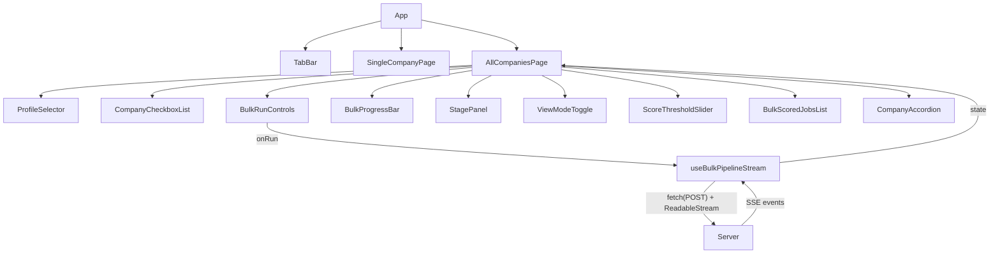

# Phase 2 — Bulk Company Search ("All Companies" page) · Technical Specification

**Version:** 1.2
**Date:** 2026-06-30
**Branch:** `main`
**Prerequisite:** Phase 4 React UI complete (T04)

---

## Table of Contents

1. [Overview & Summary](#1-overview--summary)
2. [Data Flow Diagram](#2-data-flow-diagram)
3. [API Contract — `POST /api/bulk-run`](#3-api-contract--post-apibulk-run)
4. [Output File Schema — `output/all-companies-{date}.json`](#4-output-file-schema--outputall-companies-datejson)
5. [Server-Side Type Definitions](#5-server-side-type-definitions)
6. [Streaming Protocol — SSE Event Types](#6-streaming-protocol--sse-event-types)
7. [Deduplication Algorithm](#7-deduplication-algorithm)
8. [Component Tree & New Components](#8-component-tree--new-components)
9. [State Management](#9-state-management)
10. [Supporting API Routes](#10-supporting-api-routes)
11. [Edge Cases](#11-edge-cases)
12. [Test Requirements](#12-test-requirements)
13. [Rule Compliance Notes](#13-rule-compliance-notes)
14. [Implementation Task Breakdown](#14-implementation-task-breakdown)
15. [Appendix C: Investigation Notes — EventSource vs POST](#15-appendix-c-investigation-notes--eventsource-vs-post)

---

## 1. Overview & Summary

The job-harvester currently supports a single-company pipeline: the user picks one company from a dropdown, clicks "Run", and watches the 5-stage pipeline stream progress via SSE, culminating in a scored jobs list. This Phase 2 feature adds a **bulk company search** capability — the ability to run the pipeline against multiple companies in a single session, with merged, deduplicated results.

### Key Behaviours

| Requirement | Summary |
|---|---|
| **Default view** | All jobs from all companies merged, sorted by score descending |
| **Per-company breakdown** | Accordion/tabs within the results area to view per-company results |
| **New page** | `/all-companies` route; tab bar switches between "Single Company" and "All Companies" |
| **Shared skills profile** | One profile selected from a dropdown, used across all companies in the run |
| **Per-company configs** | Each company uses its own `server/config/companies/{token}.json` |
| **Sequential execution** | Companies run one at a time in the order selected |
| **Full streaming** | Stage-by-stage progress for current company, company-level progress bar, incremental results |
| **Error handling** | Skip & continue on failure; error badge on failed companies; keep successful results |
| **Company selection** | Checkbox list with Select All / Deselect All |
| **URL deduplication** | Collapse jobs with same URL across companies; tag with all source companies; keep highest score |
| **Persist results** | Single output file `output/all-companies-{YYYY-MM-DD}.json` |
| **Server route** | `POST /api/bulk-run` — server handles full iteration, streaming, dedup, persist |
| **Score threshold** | Client-side range slider 0–100 on results view, defaults to 0 |

---

## 2. Data Flow Diagram

```
┌────────────────────────────────────────────────────────────────────────┐
│  CLIENT (React + Vite)                                                 │
│                                                                        │
│  AllCompaniesPage                                                      │
│  ├── TabBar ("Single Company" | "All Companies")                       │
│  ├── ProfileSelector (dropdown: adam, ...)                             │
│  ├── CompanyCheckboxList (checkboxes + Select All)                     │
│  ├── BulkRunControls (Run / Stop buttons)                              │
│  ├── BulkProgressBar ("3 of 5 companies done")                         │
│  ├── StagePanel (per-stage streaming for CURRENT company)              │
│  ├── ScoreThresholdSlider (0–100 range)                                │
│  ├── ViewModeToggle (Merged | By Company)                              │
│  ├── BulkScoredJobsList (merged view, score-sorted)                    │
│  └── CompanyAccordion (per-company breakdown, error badges)            │
│                                                                        │
│  useBulkPipelineStream hook                                            │
│  ├── fetch() POST /api/bulk-run → manual SSE parsing from ReadableStream│
│  │    (NOT EventSource — EventSource only supports GET, but we need    │
│  │     to POST a JSON body with { companies, profile })                │
│  ├── Processes: bulk_start, company_start, stage-start, job-passed,    │
│  │              job-rejected, stage-complete, company_complete,        │
│  │              company_error, bulk_complete                            │
│  └── Accumulates state: events[], companyStatuses{}, results{}         │
└────────────────────────────────────────────────────────────────────────┘
                               │
                               │ SSE stream (long-lived HTTP connection)
                               │ Content-Type: text/event-stream
                               ▼
┌────────────────────────────────────────────────────────────────────────┐
│  SERVER (Express + TypeScript)                                         │
│                                                                        │
│  POST /api/bulk-run                                                    │
│  │   Request: { companies: string[], profile: string }                 │
│  │   Response: text/event-stream                                       │
│  │                                                                     │
│  ├── 1. Validate request (companies non-empty, profile exists)         │
│  ├── 2. Load skills profile from server/profile/{profile}.json         │
│  ├── 3. Emit bulk_start (first SSE event)                              │
│  ├── 4. For each company (sequential):                                 │
│  │   ├── emit company_start                                            │
│  │   ├── load company config from config/companies/{token}.json        │
│  │   ├── call runPipeline(token, emit, { companyConfig, skillsProfile, │
│  │   │     skipPersist: true })                                        │
│  │   │     (modified signature — see §5.2)                             │
│  │   ├── on success: emit company_complete (with scored jobs)          │
│  │   └── on failure: emit company_error (with error message)           │
│  ├── 5. After all companies complete:                                  │
│  │   ├── Deduplicate by URL (keep highest score, tag all companies)    │
│  │   ├── Persist to output/all-companies-{date}.json                   │
│  │   └── emit bulk_complete (with dedup'd results + metadata)          │
│  └── 6. Close SSE connection                                           │
│                                                                        │
│  Orchestrator: runBulkPipeline (new)                                   │
│  └── Uses existing runPipeline with pre-loaded configs + skipPersist   │
│                                                                        │
│  Dependency changes:                                                   │
│  ├── loadSkillsProfile(profileName?: string) — parameterised           │
│  └── runPipeline gains optional third Options parameter                │
└────────────────────────────────────────────────────────────────────────┘
```

---

## 3. API Contract — `POST /api/bulk-run`

### 3.1 Request

**Method:** `POST`  
**URL:** `/api/bulk-run`  
**Content-Type:** `application/json`

```typescript
// Request body
interface BulkRunRequest {
  /** Company tokens to run, in execution order (e.g. ["figma", "anthropic", "databricks"]).
   *  Must be non-empty. Each token must have a valid config file at
   *  config/companies/{token}.json. */
  companies: string[];

  /** Skills profile name (stem of file in server/profile/, e.g. "adam").
   *  Must be a valid profile file at server/profile/{name}.json. */
  profile: string;
}
```

**Example:**
```json
{
  "companies": ["figma", "anthropic", "databricks"],
  "profile": "adam"
}
```

### 3.2 Response

**Content-Type:** `text/event-stream`  
**Cache-Control:** `no-cache`  
**Connection:** `keep-alive`

**Success path (HTTP 200, SSE stream):**

The response is an SSE stream. Each line is `data: <JSON>\n\n`. See [§6 Streaming Protocol](#6-streaming-protocol--sse-event-types) for the full event schema.

| Event sequence |
|---|
| `bulk_start` |
| For each company (in order): |
| &nbsp;&nbsp;`company_start` |
| &nbsp;&nbsp;`stage-start(1)` → `job-passed`×N → `stage-complete(1)` |
| &nbsp;&nbsp;`stage-start(2)` → `job-passed`/`job-rejected`×N → `stage-complete(2)` |
| &nbsp;&nbsp;`stage-start(3)` → `job-passed`/`job-rejected`×N → `stage-complete(3)` |
| &nbsp;&nbsp;`stage-start(4)` → `job-passed`/`job-rejected`×N → `stage-complete(4)` |
| &nbsp;&nbsp;`stage-start(5)` → `job-passed`/`job-rejected`×N → `stage-complete(5)` |
| &nbsp;&nbsp;`company_complete` (with scored jobs for this company) |
| (or `company_error` if pipeline failed) |
| `bulk_complete` (with dedup'd results) |
| Connection closed |

**Error paths (HTTP 4xx, JSON body — no SSE):**

| Status | Body | Condition |
|---|---|---|
| 400 | `{ error: "...", detail: "..." }` | `companies` is missing or empty |
| 400 | `{ error: "...", detail: "..." }` | `profile` is missing or not a string |
| 400 | `{ error: "...", detail: "..." }` | Profile file not found or invalid |
| 400 | `{ error: "...", detail: "..." }` | Any company config file missing or invalid |

**Note:** Validation of ALL inputs happens *before* the SSE stream begins. If any validation fails, the endpoint returns a 4xx JSON response and does not open an SSE stream. This prevents partial runs where one company config is missing.

### 3.3 Bulk-specific SSE Events (Summary)

| Event `type` | Payload | When |
|---|---|---|
| `bulk_start` | `{ companies: string[], profile: string, totalCompanies: number }` | Immediately after validation, before first company |
| `company_start` | `{ companyToken: string, companyName: string, index: number, totalCompanies: number }` | Before each company's pipeline begins |
| `company_complete` | `{ companyToken: string, companyName: string, reportCard: ReportCard, scoredJobs: ScoredJobSummary[] }` | After each company's pipeline succeeds |
| `company_error` | `{ companyToken: string, companyName: string, error: string }` | After each company's pipeline fails |
| `bulk_complete` | `{ totalCompanies: number, successCount: number, errorCount: number, totalRuntimeMs: number, estimatedCostUsd: number, aggregateHeuristicHits: number, aggregateLlmFallbacks: number, scoredJobs: DedupedJobSummary[], failures: CompanyErrorSummary[] }` | After all companies complete (with or without errors) |

The existing per-stage events (`stage-start`, `stage-complete`, `job-passed`, `job-rejected`) are emitted *within* a company's execution window and are identical to the single-company pipeline events. The client uses the bracketing `company_start` / `company_complete` events to know which company the per-stage events belong to.

---

## 4. Output File Schema — `output/all-companies-{date}.json`

### 4.1 File Location & Naming

- **Directory:** `output/` (created if it doesn't exist)
- **Filename:** `all-companies-{YYYY-MM-DD}.json` (e.g. `all-companies-2026-06-30.json`)
- **Overwrite:** If a file with the same date exists, **overwrite** it (latest run wins for that day)
- **Writer:** New module `server/src/output/bulkPersister.ts`

### 4.2 Schema

```typescript
interface BulkRunOutput {
  /** ISO 8601 timestamp of when the bulk run started. */
  runAt: string;

  /** Name of the skills profile used (e.g. "adam"). */
  profile: string;

  /** List of company tokens that were requested. */
  requestedCompanies: string[];

  /** List of company tokens that completed successfully. */
  successfulCompanies: CompanyRunResult[];

  /** List of company tokens that failed. */
  failedCompanies: CompanyErrorResult[];

  /** Deduplicated scored jobs, sorted by score descending. */
  scoredJobs: DedupedJobRecord[];

  /** Aggregate statistics. */
  stats: BulkRunStats;
}

interface CompanyRunResult {
  /** Company token (config filename stem). */
  token: string;

  /** Human-readable company name from config. */
  name: string;

  /** Number of scored jobs produced for this company (pre-dedup). */
  jobCount: number;

  /** How many of this company's scored jobs survived dedup. */
  dedupedCount: number;

  /** Per-stage report for this company. */
  reportCard: ReportCard;
}

interface CompanyErrorResult {
  /** Company token. */
  token: string;

  /** Human-readable company name from config. */
  name: string;

  /** Error message. */
  error: string;
}

interface DedupedJobRecord {
  /** Greenhouse job ID (from the highest-scored instance). */
  id: number;

  /** Job title. */
  title: string;

  /** Absolute URL to the Greenhouse job posting. */
  url: string;

  /** Highest score across all companies that had this job. */
  score: number;

  /** Score reasoning from the highest-scored instance. */
  scoreReasoning: string;

  /** Companies this job appeared in. */
  companies: string[];

  /** Company-specific scores: { [companyToken]: score }. */
  companyScores: Record<string, number>;

  /** Matched skills from the highest-scored instance. */
  matchedSkills: string[];

  /** Unmatched skills from the highest-scored instance. */
  unmatchedSkills: string[];

  /** Must-have requirements from the highest-scored instance. */
  mustHaves: string[];

  /** Nice-to-have requirements from the highest-scored instance. */
  niceToHaves: string[];

  /** Department (from the highest-scored instance). */
  department: string;

  /** Location (from the highest-scored instance). */
  location: string;

  /** Gap ratio from the highest-scored instance. */
  gapRatio: number;

  /** ISO 8601 — from the highest-scored instance. */
  updatedAt?: string;

  /** ISO 8601 — from the highest-scored instance. */
  firstPublished?: string;
}

interface BulkRunStats {
  /** Total number of companies attempted. */
  totalCompanies: number;

  /** Number of companies that completed successfully. */
  successCount: number;

  /** Number of companies that failed. */
  errorCount: number;

  /** Total pre-dedup scored job count across all successful companies. */
  totalJobsBeforeDedup: number;

  /** Number of jobs after deduplication. */
  totalJobsAfterDedup: number;

  /** Number of duplicate URLs collapsed. */
  duplicatesRemoved: number;

  /** Total wall-clock runtime in milliseconds. */
  totalRuntimeMs: number;

  /** Total estimated LLM cost in USD (sum across all companies). */
  estimatedCostUsd: number;

  /** Aggregate heuristic hits across all successful companies. */
  aggregateHeuristicHits: number;

  /** Aggregate LLM fallbacks across all successful companies. */
  aggregateLlmFallbacks: number;
}
```

### 4.3 Example

```json
{
  "runAt": "2026-06-30T13:45:00.000Z",
  "profile": "adam",
  "requestedCompanies": ["figma", "anthropic", "databricks"],
  "successfulCompanies": [
    {
      "token": "figma",
      "name": "Figma",
      "jobCount": 5,
      "dedupedCount": 4,
      "reportCard": { "stages": [...], "totalPassed": 5, "totalRejected": 12, "totalRuntimeMs": 45000, "estimatedCostUsd": 0.02, "heuristicHits": 3, "llmFallbacks": 2 }
    },
    {
      "token": "databricks",
      "name": "Databricks",
      "jobCount": 3,
      "dedupedCount": 2,
      "reportCard": { "stages": [...], "totalPassed": 3, "totalRejected": 8, "totalRuntimeMs": 30000, "estimatedCostUsd": 0.01, "heuristicHits": 2, "llmFallbacks": 1 }
    }
  ],
  "failedCompanies": [
    {
      "token": "anthropic",
      "name": "Anthropic",
      "error": "Greenhouse API returned 503"
    }
  ],
  "scoredJobs": [
    {
      "id": 12345,
      "title": "Privacy Program Manager",
      "url": "https://boards.greenhouse.io/figma/jobs/12345",
      "score": 9,
      "scoreReasoning": "All must-have skills matched; strong alignment on privacy and program management.",
      "companies": ["figma", "databricks"],
      "companyScores": { "figma": 9, "databricks": 7 },
      "matchedSkills": ["Privacy", "Program Management"],
      "unmatchedSkills": [],
      "mustHaves": ["Privacy expertise", "Program management experience"],
      "niceToHaves": ["SQL", "Data Analytics"],
      "department": "Legal",
      "location": "San Francisco, CA",
      "gapRatio": 0.0,
      "updatedAt": "2026-06-28T10:00:00-04:00"
    }
  ],
  "stats": {
    "totalCompanies": 3,
    "successCount": 2,
    "errorCount": 1,
    "totalJobsBeforeDedup": 8,
    "totalJobsAfterDedup": 6,
    "duplicatesRemoved": 2,
    "totalRuntimeMs": 75000,
    "estimatedCostUsd": 0.03,
    "aggregateHeuristicHits": 5,
    "aggregateLlmFallbacks": 3
  }
}
```

---

## 5. Server-Side Type Definitions

### 5.1 New Types — Add to `server/src/types/index.ts`

Per Rule 9, all shared interfaces must be defined in [`server/src/types/index.ts`](server/src/types/index.ts:1). The following types are new for Phase 2:

```typescript
// ---------------------------------------------------------------------------
// Bulk pipeline types (Phase 2)
// ---------------------------------------------------------------------------

/** Request body for POST /api/bulk-run. */
export interface BulkRunRequest {
  companies: string[];
  profile: string;
}

/** Emitted when the bulk run begins (first event in the SSE stream). */
export interface BulkStartEvent {
  type: 'bulk_start';
  companies: string[];
  profile: string;
  totalCompanies: number;
}

/** Emitted before a company's pipeline begins execution. */
export interface CompanyStartEvent {
  type: 'company_start';
  companyToken: string;
  companyName: string;
  /** 0-based index in the run order. */
  index: number;
  /** Total number of companies in the run. */
  totalCompanies: number;
}

/** Emitted after a company's pipeline completes successfully. */
export interface CompanyCompleteEvent {
  type: 'company_complete';
  companyToken: string;
  companyName: string;
  reportCard: ReportCard;
  scoredJobs: ScoredJobSummary[];
}

/** Emitted when a company's pipeline fails. */
export interface CompanyErrorEvent {
  type: 'company_error';
  companyToken: string;
  companyName: string;
  error: string;
}

/**
 * A deduplicated scored job summary sent to the client on bulk_complete.
 * Identical to ScoredJobSummary with the addition of company attribution.
 */
export interface DedupedJobSummary extends ScoredJobSummary {
  /** Companies this job appeared in. */
  companies: string[];
  /** Score per company. */
  companyScores: Record<string, number>;
}

/** Summary of a company that failed. */
export interface CompanyErrorSummary {
  token: string;
  name: string;
  error: string;
}

// ---------------------------------------------------------------------------
// Bulk output file types (also in types/index.ts per Rule 9)
// ---------------------------------------------------------------------------

/** Shape of output/all-companies-{date}.json. */
export interface BulkRunOutput {
  runAt: string;
  profile: string;
  requestedCompanies: string[];
  successfulCompanies: CompanyRunResult[];
  failedCompanies: CompanyErrorResult[];
  scoredJobs: DedupedJobRecord[];
  stats: BulkRunStats;
}

export interface CompanyRunResult {
  token: string;
  name: string;
  jobCount: number;
  dedupedCount: number;
  reportCard: ReportCard;
}

export interface CompanyErrorResult {
  token: string;
  name: string;
  error: string;
}

export interface DedupedJobRecord {
  id: number;
  title: string;
  url: string;
  score: number;
  scoreReasoning: string;
  companies: string[];
  companyScores: Record<string, number>;
  matchedSkills: string[];
  unmatchedSkills: string[];
  mustHaves: string[];
  niceToHaves: string[];
  department: string;
  location: string;
  gapRatio: number;
  updatedAt?: string;
  firstPublished?: string;
}

export interface BulkRunStats {
  totalCompanies: number;
  successCount: number;
  errorCount: number;
  totalJobsBeforeDedup: number;
  totalJobsAfterDedup: number;
  duplicatesRemoved: number;
  totalRuntimeMs: number;
  estimatedCostUsd: number;
  /** Aggregate heuristic hits across all successful companies. */
  aggregateHeuristicHits: number;
  /** Aggregate LLM fallbacks across all successful companies. */
  aggregateLlmFallbacks: number;
}

// ---------------------------------------------------------------------------
// Bulk event union and emit callback
// ---------------------------------------------------------------------------

/** Emitted when the entire bulk run completes (with or without errors). */
export interface BulkCompleteEvent {
  type: 'bulk_complete';
  totalCompanies: number;
  successCount: number;
  errorCount: number;
  totalRuntimeMs: number;
  estimatedCostUsd: number;
  /** Aggregate heuristic hits across all successful companies. */
  aggregateHeuristicHits: number;
  /** Aggregate LLM fallbacks across all successful companies. */
  aggregateLlmFallbacks: number;
  scoredJobs: DedupedJobSummary[];
  failures: CompanyErrorSummary[];
}

/** Union of all bulk-specific events. */
export type BulkPipelineEvent =
  | BulkStartEvent
  | CompanyStartEvent
  | CompanyCompleteEvent
  | CompanyErrorEvent
  | BulkCompleteEvent;

/** Union of ALL pipeline events (single-company + bulk). */
export type AnyPipelineEvent = PipelineEvent | BulkPipelineEvent;

/**
 * Callback signature for the bulk orchestrator's emit parameter.
 * Accepts both single-company PipelineEvents (emitted by runPipeline during
 * each company's execution) and BulkPipelineEvents (emitted by the bulk
 * orchestrator itself).
 */
export type BulkEmitCallback = (event: AnyPipelineEvent) => void;
```

### 5.2 Modify `runPipeline` — Accept Pre-Loaded Configs + skipPersist

The existing `runPipeline` loads configs internally and always calls `persistRun`. For the bulk orchestrator, we need to pass pre-loaded configs and suppress the per-company persistence (the bulk orchestrator writes one aggregate file instead).

**Current signature:**
```typescript
export async function runPipeline(
  companyToken: string,
  emit: EmitCallback,
): Promise<PipelineRunOutput>
```

**New signature (backward-compatible):**
```typescript
/** Options for overriding default pipeline behaviour. */
export interface PipelineRunOptions {
  /** Pre-loaded company config. When provided, skips loadCompanyConfig(). */
  companyConfig?: CompanyConfig;
  /** Pre-loaded skills profile. When provided, skips loadSkillsProfile(). */
  skillsProfile?: SkillsProfile;
  /** When true, skip `persistRun()` — the caller handles persistence.
   *  `markProcessed()` is still called (dedup cache is always updated). */
  skipPersist?: boolean;
}

export async function runPipeline(
  companyToken: string,
  emit: EmitCallback,
  options?: PipelineRunOptions,
): Promise<PipelineRunOutput>
```

**Behaviour when `options` is provided:**
- If `options.companyConfig` is set, skip `loadCompanyConfig()`. Still call `resolveBoardToken()` using the provided config.
- If `options.skillsProfile` is set, skip `loadSkillsProfile()`.
- If `options.skipPersist === true`, skip `persistRun()`. Still call `markProcessed()` for each scored job.
- When `options` is omitted (single-company route), behaviour is identical to today.

**Emit type bridge:** The `emit` parameter type remains `EmitCallback = (event: PipelineEvent) => void`. The bulk orchestrator wraps `runPipeline`'s calls, and the bulk-level events (`bulk_start`, `company_start`, `company_complete`, `company_error`, `bulk_complete`) are emitted by the bulk orchestrator itself — not through `runPipeline`'s `emit`. This means `runPipeline`'s `emit` doesn't need to accept `BulkPipelineEvent` — the bulk orchestrator has its own emit callback that accepts `AnyPipelineEvent`.

### 5.3 Modify `loadSkillsProfile()` — Parameterised Profile Name

**File:** [`server/src/config/skillsProfile.ts`](server/src/config/skillsProfile.ts:1)

**Current signature:**
```typescript
export function loadSkillsProfile(): SkillsProfile;
```

**New signature (backward-compatible default):**
```typescript
export function loadSkillsProfile(profileName?: string): SkillsProfile;
```

Implementation change:
```typescript
export function loadSkillsProfile(profileName?: string): SkillsProfile {
  const name = profileName ?? 'adam';
  const filePath = path.resolve(process.cwd(), 'profile', `${name}.json`);
  // ... rest of validation unchanged
}
```

When called with no arguments (as the single-company orchestrator and step orchestrator do), it defaults to `'adam'`, preserving existing behaviour.

### 5.4 Add to `client/src/types/events.ts`

Mirror the new event types in the client-side types file. Note that `ReportCard` and `ScoredJobSummary` already exist in this file, so the new types can reference them directly:

```typescript
// New event types (mirror of server/src/types/index.ts bulk types)
export interface BulkStartEvent {
  type: 'bulk_start';
  companies: string[];
  profile: string;
  totalCompanies: number;
}

export interface CompanyStartEvent {
  type: 'company_start';
  companyToken: string;
  companyName: string;
  index: number;
  totalCompanies: number;
}

export interface CompanyCompleteEvent {
  type: 'company_complete';
  companyToken: string;
  companyName: string;
  reportCard: ReportCard;
  scoredJobs: ScoredJobSummary[];
}

export interface CompanyErrorEvent {
  type: 'company_error';
  companyToken: string;
  companyName: string;
  error: string;
}

export interface DedupedJobSummary extends ScoredJobSummary {
  companies: string[];
  companyScores: Record<string, number>;
}

export interface BulkCompleteEvent {
  type: 'bulk_complete';
  totalCompanies: number;
  successCount: number;
  errorCount: number;
  totalRuntimeMs: number;
  estimatedCostUsd: number;
  aggregateHeuristicHits: number;
  aggregateLlmFallbacks: number;
  scoredJobs: DedupedJobSummary[];
  failures: { token: string; name: string; error: string }[];
}

export type BulkPipelineEvent =
  | BulkStartEvent
  | CompanyStartEvent
  | CompanyCompleteEvent
  | CompanyErrorEvent
  | BulkCompleteEvent;

export type AnyPipelineEvent = PipelineEvent | BulkPipelineEvent;
```

---

## 6. Streaming Protocol — SSE Event Types

### 6.1 Complete Event Stream Order

```
bulk_start
  ── company_start ("figma", index=0, totalCompanies=3)
      stage-start(1)
      job-passed(1) × N1
      stage-complete(1)
      stage-start(2)
      job-passed(2) × N2
      job-rejected(2) × N2r
      stage-complete(2)
      stage-start(3)
      job-passed(3) × N3
      job-rejected(3) × N3r
      stage-complete(3)
      stage-start(4)
      job-passed(4) × N4
      job-rejected(4) × N4r
      stage-complete(4)
      stage-start(5)
      job-passed(5) × N5
      job-rejected(5) × N5r
      stage-complete(5)
      company_complete ("figma", scoredJobs: [...], reportCard: {...})
  ── company_start ("anthropic", index=1, totalCompanies=3)
      ... (stages 1-5)
      company_error ("anthropic", error: "...")
  ── company_start ("databricks", index=2, totalCompanies=3)
      ... (stages 1-5)
      company_complete ("databricks", scoredJobs: [...], reportCard: {...})
  ── bulk_complete (dedup'd results, stats)
```

### 6.2 Event Schemas (Full)

#### `bulk_start`

```json
{
  "type": "bulk_start",
  "companies": ["figma", "anthropic", "databricks"],
  "profile": "adam",
  "totalCompanies": 3
}
```

#### `company_start`

```json
{
  "type": "company_start",
  "companyToken": "figma",
  "companyName": "Figma",
  "index": 0,
  "totalCompanies": 3
}
```

#### `stage-start` (existing, unchanged)

```json
{
  "type": "stage-start",
  "stage": 1,
  "label": "Fetch jobs"
}
```

#### `job-passed` (existing, unchanged)

```json
{
  "type": "job-passed",
  "stage": 2,
  "job": { "id": 12345, "title": "Privacy Program Manager", "url": "https://...", "matchReason": "Role+Dept match" }
}
```

#### `job-rejected` (existing, unchanged)

```json
{
  "type": "job-rejected",
  "stage": 2,
  "job": { "id": 67890, "title": "SWE", "url": "https://...", "rejectedAtStage": 2, "reason": "Department mismatch" }
}
```

#### `stage-complete` (existing, unchanged)

```json
{
  "type": "stage-complete",
  "stage": 2,
  "report": { "stage": 2, "passedCount": 5, "rejectedCount": 12 }
}
```

#### `company_complete`

```json
{
  "type": "company_complete",
  "companyToken": "figma",
  "companyName": "Figma",
  "reportCard": { "stages": [...], "totalPassed": 5, "totalRejected": 12, "totalRuntimeMs": 45000, "estimatedCostUsd": 0.02, "heuristicHits": 3, "llmFallbacks": 2 },
  "scoredJobs": [
    { "id": 12345, "title": "Privacy PM", "url": "https://...", "score": 9, "scoreReasoning": "...", "matchedSkills": ["Privacy"], "unmatchedSkills": [], "mustHaves": [...], "niceToHaves": [...], "department": "Legal", "location": "SF", "gapRatio": 0.0 }
  ]
}
```

**Important:** `scoredJobs` here are the *company-specific* scored jobs (pre-dedup). The `bulk_complete` event delivers the final deduplicated list.

#### `company_error`

```json
{
  "type": "company_error",
  "companyToken": "anthropic",
  "companyName": "Anthropic",
  "error": "Greenhouse API returned 503 Service Unavailable"
}
```

#### `bulk_complete`

```json
{
  "type": "bulk_complete",
  "totalCompanies": 3,
  "successCount": 2,
  "errorCount": 1,
  "totalRuntimeMs": 75000,
  "estimatedCostUsd": 0.03,
  "aggregateHeuristicHits": 8,
  "aggregateLlmFallbacks": 4,
  "scoredJobs": [
    {
      "id": 12345,
      "title": "Privacy Program Manager",
      "url": "https://boards.greenhouse.io/figma/jobs/12345",
      "score": 9,
      "scoreReasoning": "All must-have skills matched.",
      "companies": ["figma", "databricks"],
      "companyScores": { "figma": 9, "databricks": 7 },
      "matchedSkills": ["Privacy"],
      "unmatchedSkills": [],
      "mustHaves": ["Privacy expertise"],
      "niceToHaves": ["SQL"],
      "department": "Legal",
      "location": "San Francisco, CA",
      "gapRatio": 0.0,
      "updatedAt": "2026-06-28T10:00:00-04:00"
    }
  ],
  "failures": [
    { "token": "anthropic", "name": "Anthropic", "error": "Greenhouse API returned 503" }
  ]
}
```

### 6.3 Client-Side Event Handling

The [`useBulkPipelineStream`](#) hook (new) processes events as follows:

| Event received | State update |
|---|---|
| `bulk_start` | Set `status = 'running'`, store `totalCompanies`, initialise empty `companyStatuses` map, clear previous results |
| `company_start` | Set `currentCompany = companyToken`, initialise `companyStageEvents` map for this company |
| `stage-start` | Append to current company's stage events; update current company's stage panel |
| `job-passed` | Append to current company's stage panel passed list |
| `job-rejected` | Append to current company's stage panel rejected list |
| `stage-complete` | Mark stage as complete for current company |
| `company_complete` | Mark company as `success`, store its scored jobs in results map, append to scored jobs list (incremental render) |
| `company_error` | Mark company as `error`, store error message in companyStatuses |
| `bulk_complete` | Set `status = 'complete'`, replace incremental scored jobs with dedup'd list, store stats |
| `fetch` rejection / network error | Set `status = 'error'` with connection-failed message (only if not already terminal). No auto-reconnect |

---

## 7. Deduplication Algorithm

### 7.1 When

Deduplication runs **server-side**, **after all companies have completed** (or failed), and **before** the `bulk_complete` event is emitted.

### 7.2 Key

- Dedup key is the **absolute URL** (`ScoredJobSummary.url`).
- URLs are compared with **case-insensitive** matching and **trailing-slash normalization** (strip trailing `/` before comparison).

### 7.3 Algorithm (Pseudocode)

```
function deduplicateByUrl(companyResults: Map<string, ScoredJobSummary[]>): DedupedJobSummary[] {
  // urlMap: key = normalized URL, value = all instances
  const urlMap = new Map<string, { company: string; job: ScoredJobSummary }[]>();

  for (const [companyToken, jobs] of companyResults) {
    for (const job of jobs) {
      const normalizedUrl = job.url.toLowerCase().replace(/\/$/, '');
      if (!urlMap.has(normalizedUrl)) {
        urlMap.set(normalizedUrl, []);
      }
      urlMap.get(normalizedUrl)!.push({ company: companyToken, job });
    }
  }

  const deduped: DedupedJobSummary[] = [];

  for (const [, instances] of urlMap) {
    // Pick the instance with the highest score
    const best = instances.reduce((a, b) => (b.job.score > a.job.score ? b : a));

    // Collect all company tokens and per-company scores
    const companies = instances.map(i => i.company);
    const companyScores: Record<string, number> = {};
    for (const i of instances) {
      companyScores[i.company] = i.job.score;
    }

    deduped.push({
      ...best.job,
      companies,
      companyScores,
    });
  }

  // Sort by score descending
  deduped.sort((a, b) => b.score - a.score);

  return deduped;
}
```

### 7.4 Edge Cases in Dedup

| Case | Behaviour |
|---|---|
| Same URL, same score across companies | Keep the first instance encountered (arbitrary but deterministic) |
| URL only appears in one company | No dedup needed; `companies` = `[companyToken]`, `companyScores` = `{ [companyToken]: score }` |
| Empty URL (should never happen) | Skip the job; log a warning |
| URL has different casing across companies | Case-insensitive matching handles this |
| URL has trailing slash inconsistency | Trailing-slash normalisation handles this |

---

## 8. Component Tree & New Components

### 8.1 Page-Level Architecture

The existing `App.tsx` becomes a **router shell**. Two top-level pages:

```
<App>
  ├── <TabBar activeTab={...} onTabChange={...} />
  ├── { activeTab === 'single' && <SingleCompanyPage /> }
  └── { activeTab === 'all' && <AllCompaniesPage /> }
```

The existing single-company page content (CompanySelector, ConfigEditor, RunControls, StagePanel×5, ReportCard, ScoredJobsList) is extracted into `<SingleCompanyPage />` with no behavioural changes.

### 8.2 New Components

#### 8.2.1 `<TabBar />`

**File:** [`client/src/components/TabBar.tsx`](client/src/components/TabBar.tsx) (new)

**Props:**
```typescript
interface TabBarProps {
  activeTab: 'single' | 'all';
  onTabChange: (tab: 'single' | 'all') => void;
  /** Whether the tab can be changed (disabled during a run). */
  disabled: boolean;
}
```

**Behaviour:** Two styled tabs. Clicking switches the page. Disabled while a pipeline is running.

---

#### 8.2.2 `<ProfileSelector />`

**File:** [`client/src/components/ProfileSelector.tsx`](client/src/components/ProfileSelector.tsx) (new)

**Props:**
```typescript
interface ProfileSelectorProps {
  value: string | null;
  onChange: (profileName: string) => void;
  disabled?: boolean;
}
```

**Behaviour:** Fetches available profiles from `GET /api/profiles` on mount. Renders a `<select>` dropdown. Shows loading/error states. Profiles are listed by their filename stem (e.g. "adam", "jane").

---

#### 8.2.3 `<CompanyCheckboxList />`

**File:** [`client/src/components/CompanyCheckboxList.tsx`](client/src/components/CompanyCheckboxList.tsx) (new)

**Props:**
```typescript
interface CompanyCheckboxListProps {
  /** Set of selected company tokens. */
  selected: Set<string>;
  onChange: (selected: Set<string>) => void;
  disabled?: boolean;
}
```

**Behaviour:**
- Fetches companies from `GET /api/companies` on mount.
- Renders a checkbox per company, with the company token and a "Select All" / "Deselect All" toggle at the top.
- "Select All" sets all checkboxes; "Deselect All" clears all.
- Individual checkbox toggling adds/removes from the set.
- If no companies exist, shows an empty state message: "No companies configured. Add a company first."

---

#### 8.2.4 `<AllCompaniesPage />`

**File:** [`client/src/components/AllCompaniesPage.tsx`](client/src/components/AllCompaniesPage.tsx) (new)

**Composition (JSX structure):**
```
<AllCompaniesPage>
  <section>
    <ProfileSelector />
    <CompanyCheckboxList />
  </section>

  <BulkRunControls
    selectedCount={...}
    status={...}
    onRun={...}
    onStop={...}
  />

  { status === 'running' || status === 'complete' ? (
    <>
      <BulkProgressBar current={...} total={...} companyStatuses={...} />
      <StagePanel ... /> {/* For the CURRENTLY RUNNING company */}
    </>
  ) : null }

  { status === 'complete' || hasIncrementalResults ? (
    <>
      <ViewModeToggle mode={...} onChange={...} />
      <ScoreThresholdSlider value={...} onChange={...} />

      { viewMode === 'merged' ? (
        <BulkScoredJobsList scoredJobs={filteredJobs} />
      ) : (
        <CompanyAccordion companies={...} scoredJobs={...} threshold={...} />
      ) }
    </>
  ) : null }

  { status === 'idle' && <p>Select companies and a skills profile, then click Run.</p> }
</AllCompaniesPage>
```

**State held:**
- `selectedProfile` (string | null)
- `selectedCompanies` (Set<string>)
- `viewMode` ('merged' | 'by-company')
- `scoreThreshold` (number, 0-100, default 0)

**Uses the `useBulkPipelineStream` hook.**

---

#### 8.2.5 `<BulkRunControls />`

**File:** [`client/src/components/BulkRunControls.tsx`](client/src/components/BulkRunControls.tsx) (new)

**Props:**
```typescript
interface BulkRunControlsProps {
  selectedCount: number;
  hasProfile: boolean;
  status: 'idle' | 'running' | 'complete' | 'error';
  onRun: () => void;
  onStop: () => void;
}
```

**Behaviour:**
- **Run** button: Enabled only when `status === 'idle'`, `selectedCount > 0`, and `hasProfile === true`. Tooltip explains why disabled.
- **Stop** button: Visible only when `status === 'running'`. Closes the SSE connection and resets state. The server detects client disconnect and stops processing (does not start the next company).
- Status indicator showing current pipeline state.

---

#### 8.2.6 `<BulkProgressBar />`

**File:** [`client/src/components/BulkProgressBar.tsx`](client/src/components/BulkProgressBar.tsx) (new)

**Props:**
```typescript
interface CompanyStatus {
  token: string;
  name: string;
  status: 'pending' | 'running' | 'success' | 'error';
  error?: string;
}

interface BulkProgressBarProps {
  companyStatuses: CompanyStatus[];
  currentCompany: string | null;
}
```

**Behaviour:**
- Horizontal bar with segments per company.
- Each segment is colour-coded: grey (pending), blue (running), green (success), red (error).
- Shows "3 of 5 companies done" text.
- Hover on error segment shows the error message tooltip.

---

#### 8.2.7 `<ViewModeToggle />`

**File:** [`client/src/components/ViewModeToggle.tsx`](client/src/components/ViewModeToggle.tsx) (new)

**Props:**
```typescript
interface ViewModeToggleProps {
  mode: 'merged' | 'by-company';
  onChange: (mode: 'merged' | 'by-company') => void;
}
```

**Behaviour:** Two radio buttons or toggle buttons: "Merged View" (default) and "By Company".

---

#### 8.2.8 `<ScoreThresholdSlider />`

**File:** [`client/src/components/ScoreThresholdSlider.tsx`](client/src/components/ScoreThresholdSlider.tsx) (new)

**Props:**
```typescript
interface ScoreThresholdSliderProps {
  value: number; // 0–100
  onChange: (value: number) => void;
  disabled?: boolean;
}
```

**Behaviour:** HTML `<input type="range" min="0" max="100" step="1" />`. Shows current value as a label (e.g. "Min score: 70"). Filters are applied client-side — jobs with `score < value/10` are hidden (note: scores are 1–10, so threshold 70 = score 7+).

---

#### 8.2.9 `<BulkScoredJobsList />`

**File:** [`client/src/components/BulkScoredJobsList.tsx`](client/src/components/BulkScoredJobsList.tsx) (new)

**Props:**
```typescript
interface BulkScoredJobsListProps {
  scoredJobs: DedupedJobSummary[];
}
```

**Behaviour:** Same visual rendering as existing [`ScoredJobsList`](client/src/components/ScoredJobsList.tsx:1), with the addition of:
- Company tags/badges showing which companies the job came from.
- Per-company score breakdown in a tooltip or small inline list (e.g. "Figma: 9 · Databricks: 7").

---

#### 8.2.10 `<CompanyAccordion />`

**File:** [`client/src/components/CompanyAccordion.tsx`](client/src/components/CompanyAccordion.tsx) (new)

**Props:**
```typescript
interface CompanyAccordionProps {
  companies: CompanyStatus[];
  scoredJobsByCompany: Record<string, DedupedJobSummary[]>;
  threshold: number; // 0-100
}
```

**Behaviour:**
- Accordion (collapsible sections) — one section per company.
- Each section header shows: company name, job count, and an error badge if the company failed.
- Expanded section shows the company's jobs (filtered by the score threshold).
- Failed company sections show the error message and no jobs.
- Only successful companies with at least 1 job (post-threshold) are expandable.

---

### 8.3 Reusable Existing Components

These components can be reused **without modification**:

| Component | How reused |
|---|---|
| [`StagePanel`](client/src/components/StagePanel.tsx) | Renders per-stage streaming progress for the currently-running company in the bulk view. Props unchanged. |
| [`JobRow`](client/src/components/JobRow.tsx) | Used within `StagePanel` for passed/rejected jobs. Props unchanged. |
| [`ReportCard`](client/src/components/ReportCard.tsx) | Can be reused to show per-company report card in the accordion, or a new `BulkReportCard` can be created for aggregate stats. |
| [`ScoredJobsList`](client/src/components/ScoredJobsList.tsx) | Existing component works for per-company view (one `<ScoredJobsList />` per accordion section). For the merged view, `BulkScoredJobsList` extends it. |

### 8.4 Component Interaction Diagram



---

## 9. State Management

### 9.1 `useBulkPipelineStream` Hook

**File:** [`client/src/hooks/useBulkPipelineStream.ts`](client/src/hooks/useBulkPipelineStream.ts) (new)

**Critical difference from [`usePipelineStream`](client/src/hooks/usePipelineStream.ts:1):** The existing hook uses the browser `EventSource` API (GET-based). Because `POST /api/bulk-run` requires a JSON request body, this hook must use `fetch()` with manual SSE parsing from the response body's `ReadableStream`. See [Appendix C](#15-appendix-c-investigation-notes--eventsource-vs-post) for the implementation pattern.

**Input:** `selectedCompanies: string[]`, `profile: string`

**Exposed API:**
```typescript
interface UseBulkPipelineStreamReturn {
  state: BulkPipelineState;
  start: () => void;
  stop: () => void;
  reset: () => void;
}
```

**State shape:**
```typescript
interface BulkPipelineState {
  status: 'idle' | 'running' | 'complete' | 'error';
  error: string | null;

  // All SSE events received, in chronological order
  events: AnyPipelineEvent[];

  // Per-company statuses: pending → running → success | error
  companyStatuses: Map<string, CompanyStatusEntry>;

  // Name of the company currently being processed
  currentCompany: string | null;

  // Company-level progress
  companiesCompleted: number;
  totalCompanies: number;

  // Incremental results (accumulated as companies finish)
  // Keyed by companyToken
  incrementalResults: Map<string, {
    reportCard: ReportCard;
    scoredJobs: ScoredJobSummary[];
  }>;

  // Final dedup'd results (populated on bulk_complete)
  dedupedJobs: DedupedJobSummary[];
  failures: CompanyErrorSummary[];

  // Aggregate stats (populated on bulk_complete)
  stats: {
    totalRuntimeMs: number;
    estimatedCostUsd: number;
  } | null;

  // Per-stage events for the currently-running company
  currentStageEvents: PipelineEvent[];
}

interface CompanyStatusEntry {
  token: string;
  name: string;
  status: 'pending' | 'running' | 'success' | 'error';
  error?: string;
}
```

**Key behaviours:**
- `start()`: POSTs to `/api/bulk-run` with JSON body via `fetch()`. Manually parses SSE stream from `response.body` `ReadableStream` (see [Appendix C](#15-appendix-c-investigation-notes--eventsource-vs-post)). Sets `status = 'running'`. Uses an internal `AbortController` for cancellation.
- `stop()`: Calls `abortController.abort()`, which cancels the `fetch` and the `ReadableStream` reader. Sets `status = 'idle'` (the server detects disconnect and stops).
- `reset()`: Same as stop + clears all accumulated state.
- On `company_start`: Sets `currentCompany`, initialises `currentStageEvents`.
- On `company_complete`: Marks company as `success`, stores its results in `incrementalResults`, increments `companiesCompleted`.
- On `company_error`: Marks company as `error`, stores error message, increments `companiesCompleted`.
- On `bulk_complete`: Sets `dedupedJobs`, `failures`, `stats`, and `status = 'complete'`. Calls `abortController.abort()` synchronously before setState.
- Terminal event handling: `bulk_complete` aborts the fetch reader synchronously before setState (analogous to how `EventSource.close()` is called in the existing hook).
- On `fetch` rejection (network error): Sets `status = 'error'` with a connection-failed message. Does not attempt auto-reconnect (unlike `EventSource` which auto-reconnects by default).

### 9.2 Top-Level App State Changes

The `App` component gains:

```typescript
// New state
const [activeTab, setActiveTab] = useState<'single' | 'all'>('single');

// Tab change is disabled during pipeline runs
const tabDisabled = singlePipelineStatus !== 'idle' || bulkPipelineStatus !== 'idle';
```

### 9.3 Derived State (Client-Side Filters)

Within `AllCompaniesPage`:

```typescript
// Score threshold filtering (client-side)
const filteredJobs = useMemo(() => {
  const minScore = scoreThreshold / 10; // Convert 0-100 to 0-10
  return dedupedJobs.filter(job => job.score >= minScore);
}, [dedupedJobs, scoreThreshold]);

// Per-company filtered jobs for accordion view
const filteredByCompany = useMemo(() => {
  const minScore = scoreThreshold / 10;
  const result: Record<string, DedupedJobSummary[]> = {};
  for (const [token, jobs] of incrementalResults) {
    result[token] = jobs.filter(job => job.score >= minScore);
  }
  return result;
}, [incrementalResults, scoreThreshold]);
```

---

## 10. Supporting API Routes

### 10.1 `GET /api/profiles` — List Available Skills Profiles

**File:** Added to [`server/src/routes/config.ts`](server/src/routes/config.ts:1) or a new [`server/src/routes/profiles.ts`](server/src/routes/profiles.ts)

**Purpose:** Lists available skills profile names for the profile dropdown on the bulk page.

**Response:** `200 OK`
```json
["adam", "jane"]
```

**Implementation:**
- Scans `server/profile/` directory for `*.json` files.
- Returns the filename stems (without `.json` extension).
- Always returns an array (empty array if directory doesn't exist).

**Error:** `500` if the filesystem read fails for reasons other than directory-not-found.

### 10.2 Modified: `loadSkillsProfile(profileName?: string)`

**File:** [`server/src/config/skillsProfile.ts`](server/src/config/skillsProfile.ts:1)

**Change:** The function currently hardcodes `profile/adam.json`. It must accept an optional `profileName` parameter:

```typescript
export function loadSkillsProfile(profileName?: string): SkillsProfile {
  const name = profileName ?? 'adam';
  const filePath = path.resolve(process.cwd(), 'profile', `${name}.json`);
  // ... rest of validation unchanged
}
```

**Backward compatibility:** When called with no arguments (as the single-company orchestrator does), it defaults to `'adam'`, preserving existing behaviour.

### 10.3 No Changes to `GET /api/companies`

The existing `GET /api/companies` route already returns all available company tokens. The bulk page reuses this for the checkbox list.

---

## 11. Edge Cases

### 11.1 Zero Companies Selected

- **Behaviour:** Run button is disabled. Tooltip: "Select at least one company".
- **State:** `selectedCompanies.size === 0`.

### 11.2 All Companies Fail

- **Behaviour:** `bulk_complete` is emitted with `successCount = 0`, `errorCount = N`, `scoredJobs = []`, `failures = [...]`.
- **Client:** Shows error badges for all companies. Results area shows empty state: "All companies failed. Check error details below."
- **Output file:** Still written, with `scoredJobs: []` and `successfulCompanies: []`.

### 11.3 Stop Button During Run

- **Server-side:** The server detects the client SSE disconnect via `req.on('close', ...)`. It sets an internal abort flag and does not start the next company. The current company (mid-pipeline) is allowed to finish its current stage, or alternatively the server can abort immediately (the Greenhouse fetch and LLM calls already use AbortSignal-compatible patterns; if not, the server just doesn't start the next company).
- **Client-side:** `stop()` calls `abortController.abort()`, sets status to `idle`, clears state.
- **What's preserved:** Nothing. Stopping discards partial results. The output file is NOT written (bulk_complete never fires).
- **Future consideration:** Could add a "Save partial results" option, but out of scope for Phase 2.

### 11.4 Navigate Away Mid-Run

- **Behaviour:** The `useBulkPipelineStream` hook's cleanup effect (`useEffect` return) calls `abortController.abort()`. The server detects disconnect and stops.
- **No in-progress recovery:** When the user returns, they start fresh.

### 11.5 Empty Results from a Company

- **Behaviour:** The company's pipeline completes with zero scored jobs (e.g., Stage 2 filtered everything out as a `ConfigMismatchError`). The company is marked as `success` with `scoredJobs: []`. Zero jobs means zero contribution to dedup.
- **Accordion view:** The company section shows "0 jobs found" rather than being collapsed/absent.

### 11.6 Profile Not Found

- **Behaviour:** Validated before SSE stream begins. Returns `400` with `detail: "Skills profile not found: profile/nonexistent.json"`.
- **Client:** The `start()` function should handle a non-200 response and display the error.

### 11.7 Company Config Not Found or Invalid

- **Behaviour:** Validated before SSE stream begins (all configs loaded and validated). Returns `400` with detail listing each missing/invalid config. If validation passes, the config is used during the run.

### 11.8 Consecutive Runs (Same Session)

- **Behaviour:** After a `bulk_complete`, the user can change selections (companies, profile) and click "Run" again. The hook's `start()` method closes any existing connection, resets all state, and begins a new run. This matches the existing single-company pattern.

### 11.9 Very Large Number of Companies

- **Consideration:** If 50+ companies are selected, the SSE stream could be very long. The client should handle this gracefully (virtual scroll for the jobs list if needed — out of scope for Phase 2 MVP, but the architecture allows it).
- **Server:** No artificial limit on company count, but validation rejects empty arrays.

### 11.10 Duplicate Company Token in Selection

- **Behaviour:** The `Set<string>` in the client prevents duplicate selection. The server also deduplicates the `companies` array as a safety measure.

### 11.11 Concurrent Bulk Runs

- **Behaviour:** The server does not queue or reject concurrent runs. If two bulk-run requests arrive simultaneously, they both stream independently (each has its own SSE response). This is acceptable for Phase 2 because the cost of running against the same companies twice is low and the Greenhouse API is stateless. A future improvement could add a server-side mutex per profile name.

### 11.12 Empty Profile Directory

- **Behaviour:** `GET /api/profiles` reads the `server/profile/` directory. If the directory exists but contains no `.json` files, it returns an empty array `[]`. If the directory does not exist, it also returns `[]` (not a 500). The client's `ProfileSelector` shows "No profiles available" empty state in both cases.

### 11.13 Profile Load Failure Mid-Run

- **Behaviour:** The profile is loaded once at the start of `runBulkPipeline` before any company runs. If it fails, the entire request returns a 400 and no SSE stream is opened. If a company config fails to load (validated in the same pre-flight), all companies fail with 400. See §3.2 validation note.

---

## 12. Test Requirements

### 12.1 Server-Side Tests

| Test file | What it tests |
|---|---|
| `server/src/routes/bulk-run.test.ts` (new) | `POST /api/bulk-run` route: validates request body, returns 400 on missing/invalid inputs, sets SSE headers on valid request, emits `bulk_start`, handles single-company run, handles multi-company run, emits `company_error` on failure, emits `bulk_complete` with dedup'd results |
| `server/src/pipeline/bulkOrchestrator.test.ts` (new) | `runBulkPipeline` function: (a) `bulk_start` is the first event emitted before any `company_start`; (b) sequential execution order matches input array; (c) company failure skip-and-continue — failed company emits `company_error`, remaining companies still run; (d) dedup by URL: same URL → one entry, highest score kept, all companies tagged; (e) dedup edge: case-insensitive URL matching; (f) dedup edge: trailing-slash normalisation; (g) dedup edge: same score tie-breaking (first instance wins, deterministic); (h) dedup edge: empty/missing URL → skipped + warning; (i) empty results from a company → `company_complete` with `scoredJobs: []`; (j) all-companies-fail scenario → `bulk_complete` with `successCount: 0`, `scoredJobs: []`; (k) `bulk_complete` includes `aggregateHeuristicHits` and `aggregateLlmFallbacks` (sum across successes); (l) `bulk_complete` `failures` array matches failed companies |
| `server/src/output/bulkPersister.test.ts` (new) | Writes correct `output/all-companies-{date}.json` with full schema, overwrites existing same-date file, creates `output/` directory if needed, handles write errors gracefully |
| `server/src/config/skillsProfile.test.ts` (existing, modify) | Add test: `loadSkillsProfile('adam')` with explicit name; `loadSkillsProfile('nonexistent')` throws; `loadSkillsProfile()` (no arg) defaults to `'adam'` |
| `server/src/routes/config.test.ts` (existing, modify) | Add test: `GET /api/profiles` returns list of JSON stems from `profile/` directory, returns empty array when directory missing |

### 12.2 Client-Side Tests

| Test file | What it tests |
|---|---|
| `client/src/components/CompanyCheckboxList.test.tsx` (new) | Renders checkboxes from API response, Select All / Deselect All toggles, individual checkbox toggling, disabled state |
| `client/src/components/ProfileSelector.test.tsx` (new) | Renders dropdown from API response, selection callback, disabled state, loading/error states |
| `client/src/components/BulkRunControls.test.tsx` (new) | Run button disabled when no companies selected, Run button disabled when no profile, Stop button visible during run, Run button hidden during run |
| `client/src/components/BulkProgressBar.test.tsx` (new) | Shows correct "X of Y" text, colour-codes company segments, shows error tooltip on hover |
| `client/src/components/ScoreThresholdSlider.test.tsx` (new) | Renders range input, fires onChange, filters jobs correctly in parent |
| `client/src/components/BulkScoredJobsList.test.tsx` (new) | Renders dedup'd jobs with company tags, shows per-company scores, respects threshold filter |
| `client/src/components/CompanyAccordion.test.tsx` (new) | Renders per-company sections, shows error badges, expands/collapses sections, filters by threshold |
| `client/src/components/AllCompaniesPage.test.tsx` (new) | Integration test: renders all sub-components, tab switching, full run flow simulation |
| `client/src/hooks/useBulkPipelineStream.test.ts` (new) | Processes `bulk_start`, `company_start`, per-stage events, `company_complete`, `company_error`, `bulk_complete`; handles `fetch` network failure; `stop()` aborts via `AbortController`; `start()` resets state; SSE parsing from mock `ReadableStream` |
| `server/src/pipeline/orchestrator.test.ts` (existing, modify) | Add tests: (a) `runPipeline` with `PipelineRunOptions.companyConfig` skips `loadCompanyConfig` but still calls `resolveBoardToken`; (b) with `PipelineRunOptions.skillsProfile` skips `loadSkillsProfile`; (c) with `skipPersist: true` skips `persistRun` but still calls `markProcessed`; (d) partial options: only `companyConfig` → still loads `skillsProfile`; (e) partial options: only `skillsProfile` → still loads `companyConfig`; (f) without `options` behaves identically to current (backward compat) |

### 12.3 Test Constraints (Rule 8)

- **No live HTTP requests** in any test. The bulk route tests mock `runBulkPipeline` (or mock the Greenhouse fetch + DeepSeek client).
- **Fixture data**: The existing `server/__fixtures__/figma-api-response.json` is reused for bulk tests. New fixtures in `server/__fixtures__/` for multi-company scenarios:
  - `server/__fixtures__/bulk-anthropic-response.json` — mock Greenhouse API response for Anthropic (needed because Anthropic has a separate config with its own Greenhouse board)
  - `server/__fixtures__/config/` — existing fixture configs suffice (reuse figma fixture for basic tests). Per-company config fixtures for bulk tests use the existing `server/__fixtures__/config/figma.json`.

---

## 13. Rule Compliance Notes

| Rule | Applies? | How |
|---|---|---|
| **Rule 7** (exit criterion) | ✅ | `npm test --workspace=server` must pass clean before marking any Phase 2 task done |
| **Rule 8** (no live HTTP in tests) | ✅ | All bulk route and orchestrator tests use mocks/fixtures; no Greenhouse or DeepSeek calls |
| **Rule 9** (types in `server/src/types/index.ts`) | ✅ | All new interfaces (`BulkRunRequest`, `BulkStartEvent`, `CompanyStartEvent`, `CompanyCompleteEvent`, `CompanyErrorEvent`, `DedupedJobSummary`, `BulkCompleteEvent`, `BulkEmitCallback`, `BulkRunOutput`, `CompanyRunResult`, `CompanyErrorResult`, `DedupedJobRecord`, `BulkRunStats`, `PipelineRunOptions`) defined in the types file |
| **Rule 10** (stage modules receive pre-validated configs) | ✅ | Bulk orchestrator loads configs before calling `runPipeline` with `PipelineRunOptions`; stages never call loaders directly |
| **Rule 11** (no stage-to-stage imports) | ✅ | Bulk orchestrator is the only module that calls stage functions; stages remain independent |
| **Rule 12** (no business logic in routes/server) | ✅ | `bulk-run` route validates inputs and calls `runBulkPipeline`; all logic is in the orchestrator |
| **Rule 13** (`DEEPSEEK_API_KEY` in `.env` only) | ✅ | No changes to API key handling |
| **Rule 14** (test-first for Phase 2) | ✅ | All tests must be written first, confirmed failing, then implementation |
| **Rule 15** (Windows/PowerShell) | ✅ | No shell-specific issues anticipated for this feature |
| **Rule 16** (verify types before building) | ✅ | Types defined in this spec must exist in `server/src/types/index.ts` before any implementation |
| **Rule 17** (`he` library required) | ✅ | No changes to normalizer |
| **Rule 18** (output file constraints) | ⚠️ **Requires update** | Currently lists only `output/processed_ids.json` and `output/{company}-{date}.json`. This Phase adds `output/all-companies-{date}.json`. Rule 18 in AGENTS.md must be updated to include this third file. The `bulkPersister.ts` module is the sole writer of the new file — no other module writes to it. |

> **⚠️ Action item:** Before implementing S-3 (`bulkPersister.ts`), update Rule 18 in [`AGENTS.md`](AGENTS.md:58) to read:
> `output/processed_ids.json`, `output/{company}-{date}.json`, and `output/all-companies-{date}.json` are the only files written to the `output/` directory.

---

## 14. Implementation Task Breakdown

### Pre-Requisite Changes (Before Bulk Feature)

| Subtask | Files | Description |
|---|---|---|
| **Pre-0** | `AGENTS.md` | Update Rule 18 to include `output/all-companies-{date}.json` in the list of allowed output files |
| **Pre-1** | `server/src/config/skillsProfile.ts` | Parameterise `loadSkillsProfile(profileName?)` with default `'adam'` |
| **Pre-2** | `server/src/routes/config.ts` | Add `GET /api/profiles` route |
| **Pre-3** | `server/src/types/index.ts` | Add all new bulk types (see §5.1): event types (`BulkStartEvent` through `BulkCompleteEvent`, `BulkEmitCallback`), output types (`BulkRunOutput`, `CompanyRunResult`, `CompanyErrorResult`, `DedupedJobRecord`, `BulkRunStats`), and `PipelineRunOptions` |
| **Pre-4** | `client/src/types/events.ts` | Mirror new bulk types (see §5.4) |

### Server-Side Tasks

| Subtask | Files | Description |
|---|---|---|
| **S-1** | `server/src/pipeline/orchestrator.ts` (modify) | Refactor `runPipeline` to accept optional third `PipelineRunOptions` parameter with `companyConfig`, `skillsProfile`, and `skipPersist` fields. Backward-compatible: when omitted, loads configs from disk and persists as today. See §5.2 for exact signature |
| **S-2** | `server/src/pipeline/bulkOrchestrator.ts` (new) | Implement `runBulkPipeline(companies, profileName, emit)` — loads profile, iterates companies sequentially, loads each company config, calls `runPipeline(token, emit, { companyConfig, skillsProfile, skipPersist: true })`, catches errors per company, deduplicates results by URL, persists aggregate file, emits bulk events (`bulk_start` first, then `company_start`/`company_complete`/`company_error` per company, then `bulk_complete`). The `emit` parameter type is `BulkEmitCallback = (event: AnyPipelineEvent) => void` |
| **S-3** | `server/src/output/bulkPersister.ts` (new) | Implement `persistBulkRun(output: BulkRunOutput)` — writes `output/all-companies-{date}.json`. Overwrites same-date file. Creates `output/` directory if needed |
| **S-4** | `server/src/routes/bulk-run.ts` (new) | Implement `POST /api/bulk-run` SSE route — validates request body, loads profile + all company configs (fail-fast with 400 if any missing/invalid), sets SSE headers, creates `emit` callback with `BulkEmitCallback` type, calls `runBulkPipeline`, handles client disconnect via `req.on('close', ...)` |
| **S-5** | `server/src/server.ts` (modify) | Mount `bulk-run` routes via `app.use('/api', bulkRunRoutes)` |

### Client-Side Tasks

| Subtask | Files | Description |
|---|---|---|
| **C-1** | `client/src/App.tsx` (modify) | Add `TabBar`, extract single-company content into `SingleCompanyPage`, conditionally render `AllCompaniesPage` |
| **C-2** | `client/src/components/SingleCompanyPage.tsx` (new) | Extract existing single-company UI from App.tsx (no behavioural changes) |
| **C-3** | `client/src/components/TabBar.tsx` (new) | Tab bar with "Single Company" and "All Companies" |
| **C-4** | `client/src/hooks/useBulkPipelineStream.ts` (new) | Bulk SSE hook — POSTs to `/api/bulk-run` via `fetch()`, manually parses SSE from `ReadableStream` (NOT `EventSource` — see Appendix C) |
| **C-5** | `client/src/components/ProfileSelector.tsx` (new) | Dropdown listing available skills profiles |
| **C-6** | `client/src/components/CompanyCheckboxList.tsx` (new) | Checkbox list with Select All / Deselect All |
| **C-7** | `client/src/components/BulkRunControls.tsx` (new) | Run / Stop buttons for bulk mode |
| **C-8** | `client/src/components/BulkProgressBar.tsx` (new) | Company-level progress bar |
| **C-9** | `client/src/components/ViewModeToggle.tsx` (new) | Merged / By Company toggle |
| **C-10** | `client/src/components/ScoreThresholdSlider.tsx` (new) | 0–100 range slider |
| **C-11** | `client/src/components/BulkScoredJobsList.tsx` (new) | Merged scored jobs list with company badges |
| **C-12** | `client/src/components/CompanyAccordion.tsx` (new) | Per-company accordion breakdown |
| **C-13** | `client/src/components/AllCompaniesPage.tsx` (new) | Page composition; wires all sub-components and state |

### Test Tasks (Must Precede Implementation per Rule 14)

| Subtask | Files | Description |
|---|---|---|
| **T-0** | `server/src/pipeline/orchestrator.test.ts` (existing, modify) | Add tests for `PipelineRunOptions`: (a) pre-loaded `companyConfig` skips `loadCompanyConfig` but still calls `resolveBoardToken`; (b) pre-loaded `skillsProfile` skips `loadSkillsProfile`; (c) `skipPersist: true` suppresses `persistRun` but still calls `markProcessed`; (d) partial options: only `companyConfig` provided → `loadSkillsProfile()` still called; (e) partial options: only `skillsProfile` provided → `loadCompanyConfig()` still called; (f) no options → backward-compatible identical behaviour |
| **T-1** | `server/src/config/skillsProfile.test.ts` | Test parameterised loader |
| **T-2** | `server/src/routes/config.test.ts` | Test `GET /api/profiles` |
| **T-3** | `server/src/routes/bulk-run.test.ts` (new) | Test bulk-run route (SSE events, validation errors) |
| **T-4** | `server/src/pipeline/bulkOrchestrator.test.ts` (new) | Test dedup logic, sequential execution, error handling, `bulk_start` emitted first, `bulk_complete` includes aggregate stats |
| **T-5** | `server/src/output/bulkPersister.test.ts` (new) | Test output file writing |
| **T-6** | All client component/hook tests listed in §12.2 | Test each new component (note: `useBulkPipelineStream.test.ts` must mock `fetch` + `ReadableStream`, not `EventSource`) |

---

## Appendix A: Glossary

| Term | Meaning |
|---|---|
| **Company token** | The filename stem in `config/companies/` (e.g. `figma` → `figma.json`). Used as the Greenhouse board token when `boardToken` is empty. |
| **Skills profile** | A JSON file in `server/profile/` defining a user's skill inventory and gap threshold. |
| **SSE** | Server-Sent Events — a unidirectional HTTP streaming protocol where the server pushes `data:` lines to the client. |
| **Dedup** | Deduplication — collapsing multiple instances of the same job (identified by URL) into a single entry. |
| **Stage panel** | The per-stage UI component showing live job-passed/job-rejected counts for a single pipeline stage. |

---

## Appendix B: Open Questions / Future Considerations

1. **Stop button granularity:** Should "Stop" abort the current company mid-stage, or finish the current company then stop? Initial implementation: finish the current company (since stage functions don't currently support cancellation). Document as a future improvement.

2. **Profile management UI:** Currently there is only `adam.json`. If users add more profiles, a UI to create/edit/delete profiles would be needed. Out of scope for Phase 2.

3. **Bulk run with step mode:** Step mode (one stage at a time) is not supported for bulk runs in Phase 2. The "Run All" mode only is used.

4. **Concurrent company execution:** Future optimisation — run multiple companies in parallel with a configurable concurrency limit. Out of scope for Phase 2.

5. **Virtual scrolling for large result sets:** If dedup produces 100+ jobs, the results list may need virtual scrolling. Out of scope for Phase 2 MVP.

---

## Appendix C: Investigation Notes — EventSource vs POST

### C.1 Problem

The `POST /api/bulk-run` endpoint requires a JSON request body (`{ companies: string[], profile: string }`). However, the browser's native `EventSource` API only supports HTTP GET requests — it cannot send a request body or set the method to POST.

The existing single-company pipeline works around this by embedding the company `token` in the URL path (`GET /api/run/:token`), so `EventSource` can be used. For bulk runs, we cannot embed an arbitrary number of company tokens and a profile name in the URL path cleanly.

### C.2 Solution: Manual SSE Parsing from `fetch()`

The [`useBulkPipelineStream`](#912-usebulkpipelinestream-hook) hook must use `fetch()` with method POST and a JSON body, then manually parse the SSE stream from the response body's `ReadableStream`.

**Implementation pattern:**

```typescript
async function startBulkStream(companies: string[], profile: string): Promise<void> {
  const response = await fetch('/api/bulk-run', {
    method: 'POST',
    headers: { 'Content-Type': 'application/json' },
    body: JSON.stringify({ companies, profile }),
  });

  if (!response.ok) {
    // Handle 4xx validation errors — parse JSON error body
    const errorBody = await response.json();
    throw new Error(errorBody.detail ?? 'Bulk run request failed');
  }

  const reader = response.body!.getReader();
  const decoder = new TextDecoder();
  let buffer = '';

  try {
    while (true) {
      const { done, value } = await reader.read();
      if (done) break;

      buffer += decoder.decode(value, { stream: true });

      // Parse complete SSE messages (delimited by \n\n)
      const lines = buffer.split('\n\n');
      buffer = lines.pop() ?? ''; // Keep incomplete chunk in buffer

      for (const chunk of lines) {
        const dataLine = chunk.split('\n').find(l => l.startsWith('data: '));
        if (dataLine) {
          const json = dataLine.slice(6); // Strip "data: " prefix
          const event = JSON.parse(json) as AnyPipelineEvent;
          handleEvent(event);
        }
      }
    }
  } finally {
    // Release the reader lock on any exit path (success, error, abort)
    try {
      reader.releaseLock();
    } catch {
      // If the stream was already cancelled/errored, releaseLock may throw —
      // this is benign; the reader lock is already released by the stream.
    }
  }
}
```

### C.3 Key Implications

| Aspect | Implication |
|---|---|
| **Abort** | `reader.cancel()` replaces `EventSource.close()`. The `stop()` function calls `abortController.abort()` (an `AbortController` is passed to `fetch`). |
| **Reconnection** | `EventSource` auto-reconnects on network drop. With manual `fetch`, the hook must implement its own reconnection logic — or, as Phase 2 MVP does, simply set `status: 'error'` on network failure. |
| **The `EventSource.onerror` equivalent** | The `fetch` call rejects on network errors. Wrap in `try/catch` and set error state. |
| **Same cleanup pattern** | The `useEffect` cleanup must call `abortController.abort()` (like the existing hook calls `esRef.current.close()`). |
| **Testing** | The manual SSE parsing function is testable in isolation — pass a mock `ReadableStream` and verify events are parsed correctly. |

### C.4 Why Not Change the Route to GET?

- **GET semantics:** GET should be idempotent and safe, but a bulk run triggers LLM calls, modifies the dedup cache, and writes output files — it is not idempotent.
- **URL length limits:** Embedding 50+ company tokens plus a profile name in a query string would exceed practical URL length limits (~2000 chars in many browsers/servers).
- **Express body parsing:** POST with a JSON body is the standard pattern for data-submission endpoints.
