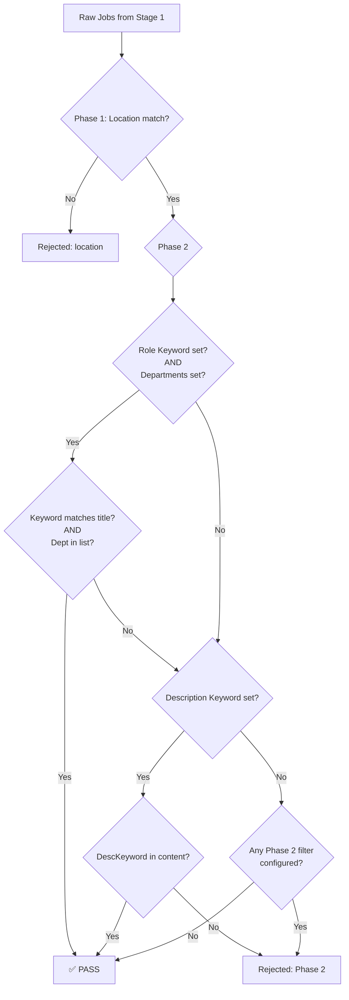

# Stage 2 — Description Keyword Filter

## Summary

Restructure Stage 2 filtering from three independent AND filters into a two-phase
model:

- **Phase 1**: Location filter (unchanged)
- **Phase 2**: `(Role Keyword AND Departments) OR (Description Keyword)`

A job passes Phase 2 if EITHER its title matches a role keyword AND its department
is in the allowed list, OR its raw description (`job.content`) contains a
description keyword. This lets the user set tight role+department constraints while
still catching roles like "Privacy Engineer" that may sit in unexpected departments.

---

## Filter Flow



---

## Type Changes

### 1. `server/src/types/index.ts` — `FilterConfig`

Add `descriptionKeyword` field:

```typescript
export interface FilterConfig {
  location: string;
  departments: string[];
  keyword: string;
  /** Comma-separated keywords matched against job.content (HTML description).
   *  Case-insensitive substring OR match. Leave blank to skip. */
  descriptionKeyword: string;   // ← NEW
}
```

### 2. `server/src/config/types.ts` — `CompanyConfig`

Add `descriptionKeyword` field:

```typescript
export interface CompanyConfig {
  name: string;
  departments: string[];
  location: string;
  keyword: string;
  boardToken: string;
  /** Comma-separated description keywords for Phase 2 OR branch.
   *  Empty string disables this filter. */
  descriptionKeyword: string;   // ← NEW
  sectionHeaders: { must_have: string[]; nice_to_have: string[] };
}
```

---

## File-by-File Changes

### 3. `server/src/config/companyConfig.ts` — Loader

Parse `descriptionKeyword` alongside `location` and `keyword` (optional, default `""`):

```typescript
// After line 93 (keyword parsing), add:
const descriptionKeyword =
  typeof parsed.descriptionKeyword === 'string' ? parsed.descriptionKeyword : '';
```

Return it in the config object (add to the return statement after `keyword`):

```typescript
return {
  // ...existing fields...
  keyword,
  descriptionKeyword,   // ← NEW
  // ...remaining fields...
};
```

**Validation**: No additional validation needed — `descriptionKeyword` is optional
and defaults to `""`. The field is not required.

---

### 4. `server/src/pipeline/stage2-filter.ts` — Core Logic Rewrite

Replace the three-sequential-filter logic with two-phase logic.

**Phase 1** (location) — unchanged.

**Phase 2** logic:

```typescript
// --- Phase 2: (Role Keyword AND Departments) OR (Description Keyword) ---

// Determine if Phase 2 filters are configured at all
const hasKeyword = config.keyword.trim().length > 0;
const hasDepartments = config.departments.length > 0;
const hasDescKeyword = config.descriptionKeyword.trim().length > 0;

let phase2Passes = false;

// Branch A: Role Keyword AND Departments
if (hasKeyword && hasDepartments) {
  const keywords = config.keyword
    .split(',')
    .map((kw) => kw.trim().toLowerCase())
    .filter((kw) => kw.length > 0);

  const jobTitle = job.title.toLowerCase();
  const roleMatch = keywords.some((kw) => jobTitle.includes(kw));

  const jobDept = job.department.name.trim().toLowerCase();
  const deptMatch = config.departments.some(
    (d) => d.toLowerCase() === jobDept,
  );

  if (roleMatch && deptMatch) {
    phase2Passes = true;
  }
}

// Branch B: Description Keyword (OR — can save a job that failed Branch A)
if (!phase2Passes && hasDescKeyword) {
  const descKeywords = config.descriptionKeyword
    .split(',')
    .map((kw) => kw.trim().toLowerCase())
    .filter((kw) => kw.length > 0);

  const jobContent = job.content.toLowerCase();
  if (descKeywords.some((kw) => jobContent.includes(kw))) {
    phase2Passes = true;
  }
}

// If no Phase 2 filters are configured at all, pass all jobs through
if (!hasKeyword && !hasDepartments && !hasDescKeyword) {
  phase2Passes = true;
}

if (!phase2Passes) {
  rejected.push({
    id: job.id,
    title: job.title,
    url: job.absolute_url,
    rejectedAtStage: 2,
    reason: `Rejected by Phase 2 filter: "${job.title}" in "${job.department.name}" does not match (role keyword AND department) and no description keyword match in [${config.descriptionKeyword || '(none)'}]`,
  });
  continue;
}
```

**Key behaviors**:
- If `keyword` is empty OR `departments` is empty → Branch A is disabled
- If `descriptionKeyword` is empty → Branch B is disabled
- If ALL THREE are empty → all jobs pass Phase 2 (only location filters)
- Branch B only evaluated if Branch A didn't already pass (short-circuit)
- Rejection reason names both branches for diagnostic clarity

**Existing location logic**: Unchanged. The `location` filter block (lines 73–98)
remains exactly as-is.

**Existing keyword/department blocks** (lines 100–140): Replaced by the new Phase 2
block above.

**`toFilteredJob` helper** (lines 34–43): Unchanged.

**`ConfigMismatchError`** (lines 20–25 and 146–149): Unchanged — still thrown when
`passed.length === 0`.

**`filterJobs` function signature**: Unchanged — still takes `(jobs: RawJob[],
config: FilterConfig)`.

---

### 5. `server/src/pipeline/stage2-filter.test.ts` — New Tests

Keep all existing location-filter tests (they remain valid). Replace the
department/keyword tests with Phase 2 tests.

**Tests to keep** (location filter — unchanged):
- `location retained`
- `location excluded`
- `case-insensitive location`
- `location retained (comma-separated, OR logic)`
- `location trims whitespace around comma-separated terms`
- `pipe-delimited location matches any segment`
- `pipe-delimited location matches any of multiple target locations`
- `pipe-delimited location rejected when no segment matches`
- `pipe-delimited location with empty config location passes all`
- `pipe-delimited location trims whitespace around segments`
- `zero-survivors throws ConfigMismatchError`
- `all rejected jobs have rejectedAtStage: 2`
- `first failing filter is the one reported`

**Tests to replace** (old department/keyword independent filters):

| Old Test | New Test | What it verifies |
|---|---|---|
| `department retained` | `(keyword AND department) both match → passes` | Branch A success |
| `department excluded` | `(keyword AND department) keyword fails → rejected` | Branch A failure on keyword |
| — | `(keyword AND department) department fails → rejected` | Branch A failure on department |
| `keyword retained (single)` | `descriptionKeyword match → passes regardless of keyword/dept` | Branch B saves a job |
| `keyword excluded (single)` | `descriptionKeyword fails, (keyword AND dept) also fails → rejected` | Both branches fail |
| `keyword retained (comma-separated, OR logic)` | `descriptionKeyword comma-separated OR logic` | Multiple desc keywords |
| `keyword excluded (comma-separated, none match)` | — (covered by above) | — |
| `keyword trims whitespace` | `descriptionKeyword trims whitespace` | Whitespace handling |
| `case-insensitive department` | `case-insensitive descriptionKeyword` | Case insensitivity on content |
| `case-insensitive keyword` | `case-insensitive keyword in Branch A` | Case insensitivity on title |
| `department with trailing whitespace` | (keep or merge into Branch A tests) | — |
| — | `keyword empty, dept set, descKeyword set → Branch A disabled` | Empty keyword handling |
| — | `dept empty, keyword set, descKeyword set → Branch A disabled` | Empty dept handling |
| — | `all Phase 2 fields empty → passes all` | No Phase 2 filter configured |
| — | `(keyword AND dept) passes, descKeyword not checked (short-circuit)` | Short-circuit optimization |

**Estimated**: ~16 test cases (keeping ~13 location/rejection tests, adding ~12 new
Phase 2 tests, removing ~6 old independent-filter tests).

---

### 6. `server/src/pipeline/orchestrator.ts` — FilterConfig Assembly

In [`runPipeline()`](server/src/pipeline/orchestrator.ts:382), add
`descriptionKeyword` to the filterConfig:

```typescript
const filterConfig: FilterConfig = {
  location: companyConfig.location,
  departments: companyConfig.departments,
  keyword: companyConfig.keyword,
  descriptionKeyword: companyConfig.descriptionKeyword,   // ← NEW
};
```

Also update the logger call in [`executeStage2()`](server/src/pipeline/orchestrator.ts:114):

```typescript
logger.stageStart(2, 'Metadata filter', {
  input: jobs.length,
  location: config.location || '(any)',
  departments: config.departments,
  keyword: config.keyword || '(any)',
  descriptionKeyword: config.descriptionKeyword || '(any)',   // ← NEW
});
```

### 7. `server/src/pipeline/stepOrchestrator.ts` — FilterConfig Assembly

In [`createStepSession()`](server/src/pipeline/stepOrchestrator.ts:122), add the
same field:

```typescript
const filterConfig: FilterConfig = {
  location: companyConfig.location,
  departments: companyConfig.departments,
  keyword: companyConfig.keyword,
  descriptionKeyword: companyConfig.descriptionKeyword,   // ← NEW
};
```

---

### 8. Company Config JSONs

Add `"descriptionKeyword": ""` to each config file. The field is optional and
defaults to `""` when absent, but adding it explicitly makes the schema visible.

**Files to update**:
- `server/config/companies/figma.json`
- `server/config/companies/anthropic.json`
- `server/config/companies/databricks.json`
- `server/config/companies/instacart.json`
- `server/__fixtures__/config/figma.json` (test fixture)
- `server/__fixtures__/config/adam.json` (test fixture — if applicable)

---

## What does NOT change

- Location filter logic — completely untouched
- `FilteredJob` type — unchanged (description is part of `content` which already
  flows through)
- `toFilteredJob` helper — unchanged
- `ConfigMismatchError` — still thrown when zero jobs survive
- `RejectedJob` shape — unchanged
- Stage 3/4/5 — they receive the same `FilteredJob[]` shape
- Client-side types (`client/src/types/events.ts`) — Stage 2 events carry the same
  payload shapes
- `DiscoverResponse` / suggest-keywords — these operate on titles/departments, not
  description keywords

---

## Edge Cases Covered

| Scenario | Behavior |
|---|---|
| `keyword=""`, `departments=[]`, `descriptionKeyword=""` | All jobs pass Phase 2 (only location filters) |
| `keyword="Engineer"`, `departments=["Engineering"]`, `descriptionKeyword=""` | Only Branch A active |
| `keyword=""`, `departments=[]`, `descriptionKeyword="Privacy"` | Only Branch B active |
| `keyword="Engineer"`, `departments=[]`, `descriptionKeyword="Privacy"` | Branch A disabled (no depts), only Branch B |
| `keyword=""`, `departments=["Engineering"]`, `descriptionKeyword="Privacy"` | Branch A disabled (no keyword), only Branch B |
| Job matches both Branch A AND Branch B | Passes via Branch A (short-circuit — Branch B not evaluated) |
| Job matches neither branch, but location passes | Rejected with reason mentioning both branches |
| `descriptionKeyword` contains commas with whitespace | Trimmed like `keyword` |
| `descriptionKeyword` matches HTML tags/attributes in content | Yes — it's substring matching on raw HTML. User should use specific terms like "GDPR" not "div" |
