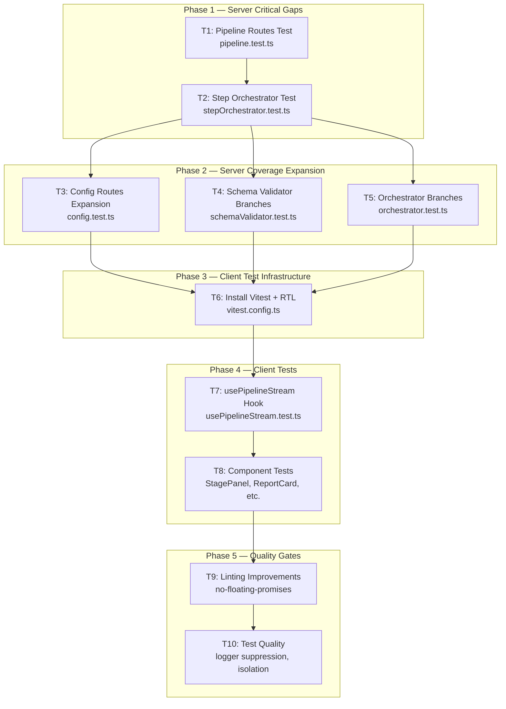

# Testing Improvement Plan

> **Audit Source:** Job Harvester Testing Audit (2026-06-29)
> **Plan Version:** 1.3
> **Last Revised:** 2026-06-29

---

## 1. Current State Summary

| Metric | Server | Client |
|--------|--------|--------|
| Test Suites | 15 | 0 (runtime) |
| Tests | 157 | 0 |
| Statement Coverage | 85.07% | N/A |
| Branch Coverage | 70.98% | N/A |
| Test Framework | Jest + ts-jest + supertest | `eslint && tsc --noEmit` only |

**Critical gaps (0% coverage, no test file):**
- [`server/src/routes/pipeline.ts`](server/src/routes/pipeline.ts) — SSE endpoint with EventSource auto-reconnect regression risk
- [`server/src/pipeline/stepOrchestrator.ts`](server/src/pipeline/stepOrchestrator.ts) — Core step-mode feature

**High gaps:**
- [`server/src/routes/config.ts`](server/src/routes/config.ts) — 50.59% (CRUD endpoints missing)
- [`server/src/llm/schemaValidator.ts`](server/src/llm/schemaValidator.ts) — 77.61% (branch coverage gaps)
- [`server/src/pipeline/orchestrator.ts`](server/src/pipeline/orchestrator.ts) — 46.42% branch coverage

**Client:** Zero runtime tests. No Vitest, no React Testing Library. The [`usePipelineStream`](client/src/hooks/usePipelineStream.ts) hook — which had the auto-reconnect bug — is completely untested.

---

## 2. Coverage Targets

| Target | Current | Goal |
|--------|---------|------|
| Server Statement | 85.07% | **>90%** |
| Server Branch | 70.98% | **>80%** |
| Client Runtime Tests | 0 | **>0** (prioritized hook + component tests) |

> **Caveat:** The orchestrator has the largest branch gap (46.42%). If branch coverage does not reach >80% after T5, run `npx jest --coverage --collectCoverageFrom='src/pipeline/orchestrator.ts'` and inspect the HTML coverage report at `server/coverage/lcov-report/pipeline/orchestrator.ts.html` to identify remaining uncovered branches for a follow-up round.

---

## 3. Execution Order & Dependency Graph



**Rationale for ordering:**
1. **T1 first** — User's explicit priority: EventSource regression test for pipeline routes.
2. **T2 second** — Step orchestrator is the other 0%-coverage critical file; depends on understanding the executeStage* interface from T1 context.
3. **T3–T5** — Expand existing test files to hit branch targets. T3, T4, and T5 are **independent of each other** and can be parallelized across multiple contributors. They only depend on T1 (which establishes the Express route testing pattern) and T2.
4. **T6** — Client infrastructure must exist before client tests can be written.
5. **T7–T8** — Hook tests first (highest risk: auto-reconnect bug), then component tests.
6. **T9–T10** — Linting and test quality are final polish; safe to do last.

---

## 4. Detailed Task Breakdown

### T1: Pipeline Routes Test

**File:** `server/src/routes/pipeline.test.ts` (NEW)

**Scope:** Test the SSE route handlers in isolation. Mock `runPipeline` and all step orchestrator functions. Verify route-level concerns: SSE headers, function calls, error handling. Do NOT re-test orchestrator behavior.

**Mock strategy:**
```typescript
// jest.mock calls are hoisted — define jest.fn() inside the factory.
// Use mockImplementation in beforeEach to emit test-specific events.
jest.mock('../pipeline/orchestrator', () => ({
  runPipeline: jest.fn(),
}));
jest.mock('../pipeline/stepOrchestrator', () => ({
  createStepSession: jest.fn(),
  startStepSession: jest.fn(),
  advanceStepSession: jest.fn(),
  cancelStepSession: jest.fn(),
}));

// After imports, cast to access mock methods:
import { runPipeline } from '../pipeline/orchestrator';
const mockRunPipeline = runPipeline as jest.Mock;

beforeEach(() => {
  // Must use mockImplementation so the route's SSE stream receives events.
  mockRunPipeline.mockImplementation(
    async (_token: string, emit: (event: PipelineEvent) => void) => {
      emit({ type: 'stage-start', stage: 1, label: 'Fetch jobs' });
      emit({ type: 'run-complete', reportCard: mockReportCard, scoredJobs: [] });
    },
  );
});
```

**Test cases — Run All (`GET/POST /api/run/:token`):**

| # | Test | Description |
|---|------|-------------|
| 1.1 | `sets SSE headers on run-all request` | Verify `Content-Type: text/event-stream`, `Cache-Control: no-cache`, `Connection: keep-alive` |
| 1.2 | `calls runPipeline exactly once per request` | **Regression test** — the EventSource auto-reconnect bug would manifest as multiple `runPipeline` calls. Verify `runPipeline` is called exactly once. |
| 1.3 | `emits stage-start event through SSE stream` | Verify SSE `data:` lines contain stage-start events from mocked `runPipeline` |
| 1.4 | `emits run-complete event through SSE stream` | Verify terminal event is streamed |
| 1.5 | `emits run-error when runPipeline throws` | Verify `run-error` event with correct stage and error message |
| 1.6 | `closes SSE stream after completion` | Verify `res.end()` is called (response completes) |
| 1.7 | `closes SSE stream on client disconnect` | Simulate `req.emit('close')` — verify stream terminates without errors |

**Test cases — Step Mode (`POST /api/run/:token/step/start`):**

| # | Test | Description |
|---|------|-------------|
| 1.8 | `sets SSE headers on step-start request` | Same header verification as run-all |
| 1.9 | `calls createStepSession then startStepSession` | Verify call order and arguments (token, res, emit) |
| 1.10 | `does NOT close SSE after startStepSession completes` | Key step-mode behavior: connection stays open for subsequent stages |
| 1.11 | `emits run-error on startStepSession failure` | Error path — emit error and close |

**Test cases — Step Mode (`POST /api/run/:token/step/next`):**

| # | Test | Description |
|---|------|-------------|
| 1.12 | `calls advanceStepSession and returns {ok: true}` | Happy path — 200 JSON response |
| 1.13 | `returns 500 when advanceStepSession throws` | Error path — 500 with error message |
| 1.14 | `returns 500 for unexpected error shape` | Non-Error throw produces 'Unknown step advance error' |

**Test cases — Step Mode (`POST /api/run/:token/step/cancel`):**

| # | Test | Description |
|---|------|-------------|
| 1.15 | `calls cancelStepSession and returns {ok: true}` | Happy path — 200 JSON |
| 1.16 | `returns {ok: true} even when session does not exist` | cancelStepSession is best-effort; no error if session missing |

**Test cases — Token handling:**

| # | Test | Description |
|---|------|-------------|
| 1.17 | `handles URL-encoded token in run-all route` | Token with special characters (e.g., `my%20company`) is passed through to `runPipeline` correctly |
| 1.18 | `handles URL-encoded token in step routes` | Same verification for step/start, step/next, step/cancel |

**Verification:** `npm test --workspace=server` passes with all 18 tests.

---

### T2: Step Orchestrator Test

**File:** `server/src/pipeline/stepOrchestrator.test.ts` (NEW)

**Scope:** Test session lifecycle management and stage-advance logic. Mock `executeStage1`–`executeStage5` from `../pipeline/orchestrator`, config loaders, dedup cache, run persister, and logger.

**Mock strategy:**
```typescript
jest.mock('./orchestrator', () => {
  const actual = jest.requireActual('./orchestrator');
  return {
    ...actual,
    runPipeline: actual.runPipeline, // keep real for type exports
    executeStage1: jest.fn(),
    executeStage2: jest.fn(),
    executeStage3: jest.fn(),
    executeStage4: jest.fn(),
    executeStage5: jest.fn(),
  };
});
jest.mock('../config/companyConfig', () => ({
  loadCompanyConfig: jest.fn(),
  resolveBoardToken: jest.fn(),
}));
jest.mock('../config/skillsProfile', () => ({
  loadSkillsProfile: jest.fn(),
}));
jest.mock('../output/dedupCache', () => ({
  markProcessed: jest.fn(),
}));
jest.mock('../output/runPersister', () => ({
  persistRun: jest.fn(),
}));
```

**Test cases:**

| # | Test | Description |
|---|------|-------------|
| 2.1 | `createStepSession loads configs and stores session` | Verify `loadCompanyConfig` and `loadSkillsProfile` are called; session is retrievable via `getStepSession` |
| 2.2 | `createStepSession replaces existing session for same token` | Create session A, create session B for same token — verify old session is cancelled (res.end called), new session replaces it |
| 2.3 | `createStepSession cleans up on client disconnect` | Simulate `res.emit('close')` — verify session is removed from store |
| 2.4 | `startStepSession runs Stage 1 and emits stage-ready(1)` | Happy path: `executeStage1` resolves, `currentStage` becomes 1, `stage-ready` event with `nextStage: 2` emitted |
| 2.5 | `startStepSession is no-op when session does not exist` | Call with unknown token — no errors, no events emitted |
| 2.6 | `startStepSession handles Stage 1 error` | `executeStage1` rejects — verify `run-error` emitted, session cleaned up |
| 2.7 | `advanceStepSession runs Stage 2 after Stage 1` | `currentStage=1` → calls `executeStage2`, emits `stage-ready(2, nextStage:3)`, updates `currentStage=2` |
| 2.8 | `advanceStepSession runs Stage 3 after Stage 2` | `currentStage=2` → calls `executeStage3`, emits `stage-ready(3, nextStage:4)` |
| 2.9 | `advanceStepSession runs Stage 4 after Stage 3` | `currentStage=3` → calls `executeStage4`, emits `stage-ready(4, nextStage:5)` |
| 2.10 | `advanceStepSession runs Stage 5 and finalises` | `currentStage=4` → calls `executeStage5`, emits `run-complete` with ReportCard, persists output, marks processed |
| 2.11 | `advanceStepSession is no-op for missing session` | Call with unknown token — no errors |
| 2.12 | `advanceStepSession is no-op for finished session` | `session.finished = true` — advance does nothing |
| 2.13 | `advanceStepSession handles stage error gracefully` | Stage throws — `run-error` emitted, session cleaned up |
| 2.14 | `advanceStepSession defaults to unknown stage` | `currentStage=5` (already complete) — advance logs warning, does nothing |
| 2.15 | `cancelStepSession closes SSE and removes session` | Verify `res.end()` called, session deleted from store |
| 2.16 | `cancelStepSession is no-op when session does not exist` | Call with unknown token — no errors |
| 2.17 | `concurrent sessions for different tokens do not interfere` | Create sessions for "figma" and "databricks" — advance one, verify the other is unaffected |
| 2.18 | `finaliseStepSession computes correct ReportCard` | Verify `totalPassed`, `totalRejected`, `totalRuntimeMs`, `estimatedCostUsd` values |
| 2.19 | `finaliseStepSession calls persistRun with correct shape` | Verify `PipelineRunOutput` structure: companyToken, status, reportCard, scoredJobs, rejectedJobs |
| 2.20 | `finaliseStepSession calls markProcessed for each scored job` | Verify `markProcessed` called with each job ID |
| 2.21 | `advanceStepSession to Stage 4 throws when Stage 3 result missing` | Set `session.stage3Result = undefined` — advance from stage 3 throws `'Stage 3 result missing'` error, `run-error` emitted |
| 2.22 | `advanceStepSession to Stage 5 throws when Stage 4 result missing` | Set `session.stage4Result = undefined` — advance from stage 4 throws `'Stage 4 result missing'` error, `run-error` emitted |

**Verification:** `npm test --workspace=server` passes with all 22 tests.

---

### T3: Config Routes Test Expansion

**File:** `server/src/routes/config.test.ts` (MODIFY — extend existing)

**Scope:** Add tests for the currently untested CRUD endpoints. The existing file covers `suggest-keywords`, `POST /api/config/company` (create), and `DELETE`. Missing endpoints need coverage.

**New test cases — `GET /api/companies`:**

| # | Test | Description |
|---|------|-------------|
| 3.1 | `lists available company tokens` | Mock filesystem to return `.json` files — verify token list (stripped extensions) |
| 3.2 | `returns empty array when config directory is missing` | No `config/companies/` directory — returns `[]` |
| 3.3 | `filters out non-JSON files` | Directory contains `.json` and `.md` files — only `.json` stems returned |

**New test cases — `GET /api/config/company/:token`:**

| # | Test | Description |
|---|------|-------------|
| 3.4 | `returns company config for valid token` | `loadCompanyConfig` returns config — 200 with config body |
| 3.5 | `returns 400 when config file does not exist` | `loadCompanyConfig` throws `ConfigValidationError` — 400 with validation error |
| 3.6 | `returns 400 when config has validation errors` | Config exists but is invalid — 400 response |

**New test cases — `PUT /api/config/company/:token`:**

| # | Test | Description |
|---|------|-------------|
| 3.7 | `updates company config and returns validated result` | Write new config, load succeeds — 200 with config |
| 3.8 | `rolls back on validation failure and returns 400` | Write invalid config, validation fails — backup restored, 400 response |
| 3.9 | `creates new file when no backup exists and validation fails` | First write, validation fails — file deleted, 400 response |
| 3.10 | `creates config directory if it does not exist` | `fs.mkdirSync` called with `{recursive: true}` |

**New test cases — `GET /api/config/profile`:**

| # | Test | Description |
|---|------|-------------|
| 3.11 | `returns skills profile` | `loadSkillsProfile` returns profile — 200 |
| 3.12 | `returns 400 when profile is invalid` | `loadSkillsProfile` throws — 400 response |

**New test cases — `PUT /api/config/profile`:**

| # | Test | Description |
|---|------|-------------|
| 3.13 | `updates profile and returns validated result` | Happy path — 200 |
| 3.14 | `rolls back on validation failure` | Backup restored, 400 response |

**New test cases — `POST /api/config/profile/suggest-aliases`:**

| # | Test | Description |
|---|------|-------------|
| 3.15 | `returns aliases from DeepSeek` | Mock `callDeepSeek` — 200 with aliases array |
| 3.16 | `returns 400 when skillName is missing` | Request body has no `skillName` — 400 |
| 3.17 | `returns 400 when skillName is empty string` | `skillName: "  "` — 400 |
| 3.18 | `returns 400 when skillName is not a string` | `skillName: 123` — 400 |
| 3.19 | `returns 502 on LlmApiError` | `callDeepSeek` throws `LlmApiError` — 502 |
| 3.20 | `returns 502 on LlmSchemaError` | `callDeepSeek` throws `LlmSchemaError` — 502 |
| 3.21 | `returns 500 on unexpected error` | Generic `Error` thrown — 500 |

**Verification:** `npm test --workspace=server` passes with all new + existing tests.

> **Filesystem note:** Config route tests write real files to `config/companies/` and `profile/` directories. Do not run these tests while `npm run dev --workspace=server` is active, as the dev server may read or write the same directories. For CI, this is not an issue.

---

### T4: Schema Validator Branch Coverage

**File:** `server/src/llm/schemaValidator.test.ts` (MODIFY — extend existing)

**Scope:** Add tests for uncovered branches. Current tests cover happy paths and basic error paths. Missing: root-level validation, array item type checking, non-nullable null values, score minimum boundary, whitespace-only strings.

**New test cases:**

| # | Test | Description |
|---|------|-------------|
| 4.1 | `throws when root value is null` | `validateSchema(null, ...)` → `LlmSchemaError` with field `(root)` |
| 4.2 | `throws when root value is a string` | `validateSchema("hello", ...)` → `LlmSchemaError` |
| 4.3 | `throws when root value is a number` | `validateSchema(42, ...)` → `LlmSchemaError` |
| 4.4 | `throws when array item is wrong type` | `must_haves: ["React", 123]` → `LlmSchemaError` on `must_haves[1]` |
| 4.5 | `throws when non-nullable field is null` | `score: null` (not in allowed types) → `LlmSchemaError` |
| 4.6 | `throws when score is below minimum` | `score: 0` → `LlmSchemaError` with `number >= 1` |
| 4.7 | `throws when scoreReasoning is whitespace only` | `scoreReasoning: "   "` → `LlmSchemaError` with `non-empty string` |
| 4.8 | `accepts optional field when not present` | `years_experience_required` not in object → passes |
| 4.9 | `throws when required field is undefined` | `must_haves` completely missing → `LlmSchemaError` |

**Verification:** `npm test --workspace=server` passes with all new + existing tests. Branch coverage for `schemaValidator.ts` >90%.

---

### T5: Orchestrator Branch Coverage

**File:** `server/src/pipeline/orchestrator.test.ts` (MODIFY — extend existing)

**Scope:** The orchestrator has 46.42% branch coverage. The existing 7 tests cover the main happy path and `ConfigMismatchError`. Missing branches likely include: empty input to stages, dedup cache filtering, error propagation through intermediate stages, and the `resolveBoardToken` fallback path.

**New test cases:**

| # | Test | Description |
|---|------|-------------|
| 5.1 | `handles empty job list from Stage 1` | `fetchJobs` returns `{jobs: [], rawCount: 0}` — verify skips remaining stages, `run-complete` with zero counts |
| 5.2 | `filters previously processed jobs at Stage 3 boundary` | `isProcessed` returns `true` for some jobs — verify those are rejected with "Already processed" reason |
| 5.3 | `handles Stage 3 error after dedup check` | `extractJobs` throws — `run-error` emitted, no further stages |
| 5.4 | `handles Stage 4 error` | `filterByGap` throws — `run-error` emitted |
| 5.5 | `handles Stage 5 error` | `scoreJobs` throws — `run-error` emitted |
| 5.6 | `uses boardToken when company config has one` | `companyConfig.boardToken = "custom-board"` — `fetchJobs` called with "custom-board", not the token |
| 5.7 | `falls back to token when boardToken is empty` | `companyConfig.boardToken = ""` — `fetchJobs` called with the original token |
| 5.8 | `emits stage-complete with correct passed/rejected counts` | Verify `stage-complete` event payload after each stage |
| 5.9 | `emits run-complete with correct scoredJobSummaries shape` | Verify the mapping from `ScoredJob` to `ScoredJobSummary` |

**Verification:** `npm test --workspace=server` passes with all new + existing tests. Branch coverage for `orchestrator.ts` >80%.

---

### T6: Client Test Infrastructure Setup

**Files affected:** `client/package.json`, `client/vitest.config.ts` (NEW), `client/tsconfig.json`

**Steps:**

1. **Install dependencies:**
   ```bash
   npm install --save-dev --workspace=client \
     vitest \
     @testing-library/react \
     @testing-library/jest-dom \
     @testing-library/user-event \
     jsdom
   ```

   > **React 19 compatibility:** Verify `@testing-library/react` version supports React 19. Use `@testing-library/react@latest` (v16+). If compatibility issues arise, consult the [React Testing Library v16 migration guide](https://testing-library.com/docs/react-testing-library/intro/).


2. **Create [`client/vitest.config.ts`](client/vitest.config.ts):**
   ```typescript
   import { defineConfig } from 'vitest/config';
   import react from '@vitejs/plugin-react';

   export default defineConfig({
     plugins: [react()],
     test: {
       environment: 'jsdom',
       globals: true,
       setupFiles: ['./src/test-setup.ts'],
     },
   });
   ```

3. **Create [`client/src/test-setup.ts`](client/src/test-setup.ts):**
   ```typescript
   import '@testing-library/jest-dom/vitest';
   ```

4. **Update [`client/package.json`](client/package.json)** — replace `"test"` script:
   ```json
   "test": "vitest run"
   ```

5. **Update [`client/tsconfig.json`](client/tsconfig.json)** — ensure `vitest/globals` types are included if using globals, or add `"types": ["vitest/globals"]` to compilerOptions.

**Verification:** `npm test --workspace=client` runs without errors (0 tests is acceptable at this stage — `passWithNoTests` or equivalent).

---

### T7: usePipelineStream Hook Tests

**File:** `client/src/hooks/usePipelineStream.test.ts` (NEW)

**Scope:** Test the hook's EventSource lifecycle, state transitions, and the critical auto-reconnect regression fix. Since `EventSource` is not available in jsdom, create a minimal mock.

**Mock strategy:**
- Create a mock `EventSource` class with `close()`, `onmessage`, `onerror` handlers
- Mock `globalThis.EventSource` before each test
- Mock `globalThis.fetch` for `nextStage` and `cancelStep` POST requests
- Use `@testing-library/react`'s `renderHook` with `act()` for state transitions

**Test cases:**

| # | Test | Description |
|---|------|-------------|
| 7.1 | `initial state is idle` | Hook returns `status: 'idle'`, empty events, no error |
| 7.2 | `start() creates EventSource with correct URL` | `new EventSource("/api/run/figma")` called |
| 7.3 | `start() sets status to running` | After `start()`, status is `'running'` |
| 7.4 | `start() closes previous EventSource before creating new one` | Call `start()` twice — first EventSource is `.close()`d |
| 7.5 | `handleMessage updates events for stage-start` | Dispatch `MessageEvent` with `stage-start` JSON — event appears in `state.events` |
| 7.6 | `handleMessage updates events for stage-complete` | Dispatch `stage-complete` — `stageReports` updated with counts |
| 7.7 | `handleMessage updates events for job-passed` | Dispatch `job-passed` — event accumulated |
| 7.8 | `handleMessage updates events for job-rejected` | Dispatch `job-rejected` — event accumulated |
| 7.9 | `run-complete event closes EventSource synchronously` | **Regression test** — dispatch `run-complete`; verify `EventSource.close()` was called BEFORE state update (prevents auto-reconnect loop) |
| 7.10 | `run-error event closes EventSource synchronously` | **Regression test** — dispatch `run-error`; verify `EventSource.close()` called synchronously |
| 7.11 | `run-complete sets status to complete` | After `run-complete`, status is `'complete'` |
| 7.12 | `run-error sets status to error with message` | After `run-error`, status is `'error'`, error message is set |
| 7.13 | `onerror closes EventSource and sets error state` | **Regression test** — trigger `onerror`; verify `EventSource.close()` called, status is `'error'` |
| 7.14 | `onerror does not override terminal state` | Set status to `'complete'`, trigger `onerror` — status stays `'complete'` |
| 7.15 | `events after terminal state are ignored` | `run-complete` already received, dispatch another event — no change |
| 7.16 | `handleMessage skips malformed JSON` | Dispatch non-JSON data — no state change, no crash |
| 7.17 | `reset() closes EventSource and resets state` | Call `start()`, then `reset()` — status is `'idle'`, EventSource closed |
| 7.18 | `startStep() creates EventSource for step endpoint` | URL is `/api/run/figma/step/start` |
| 7.19 | `stage-ready event sets status to awaiting_input` | Dispatch `stage-ready` — status is `'awaiting_input'`, `nextStage` set |
| 7.20 | `onerror during awaiting_input does not override to error` | **Step mode regression** — status `'awaiting_input'` (SSE still open), network blip — status stays `'awaiting_input'` |
| 7.21 | `nextStage() sends POST and sets status to running` | `fetch` called with POST to step/next; status transitions to `'running'` |
| 7.22 | `nextStage() handles fetch failure gracefully` | `fetch` rejects — status becomes `'error'` with message |
| 7.23 | `cancelStep() sends POST then calls reset()` | `fetch` to step/cancel; `reset()` called in `.finally()` |
| 7.24 | `cleanup on unmount closes EventSource` | Unmount hook — `EventSource.close()` called |

**Verification:** All 24 tests pass with `npm test --workspace=client`.

---

### T8: Client Component Tests (Prioritized)

**Scope:** Smoke/render tests for key components. Full interaction tests only for components with complex state logic.

**Priority order (by risk):**

| Priority | Component | File | Risk |
|----------|-----------|------|------|
| P1 | `StagePanel` | `client/src/components/StagePanel.test.tsx` (NEW) | Displays live SSE data; stale state bugs |
| P2 | `RunControls` | `client/src/components/RunControls.test.tsx` (NEW) | Disables Run button on unsaved changes |
| P3 | `ReportCard` | `client/src/components/ReportCard.test.tsx` (NEW) | Displays final report data |
| P4 | `CompanySelector` | `client/src/components/CompanySelector.test.tsx` (NEW) | Token selection → pipeline trigger |
| P5 | `ScoredJobsList` | `client/src/components/ScoredJobsList.test.tsx` (NEW) | Renders sorted list |
| P6 | `JobRow` | `client/src/components/JobRow.test.tsx` (NEW) | Renders individual job |
| P7 | `AddCompanyDialog` | `client/src/components/AddCompanyDialog.test.tsx` (NEW) | Form validation |
| P8 | `ConfigEditor` | `client/src/components/ConfigEditor.test.tsx` (NEW) | Unsaved changes detection |

**Test cases per component (minimum):**

**StagePanel:**
| # | Test |
|---|------|
| 8.1 | `renders stage label and status` |
| 8.2 | `displays passed/rejected counts from stageReports` |
| 8.3 | `shows "Pending" when stage has not started` |
| 8.4 | `shows "Running" indicator for active stage` |

**RunControls:**
| # | Test |
|---|------|
| 8.5 | `Run button enabled when no unsaved changes` |
| 8.6 | `Run button disabled when hasUnsavedChanges is true` |
| 8.7 | `displays "Unsaved changes" warning indicator` |
| 8.8 | `Step Mode checkbox toggles mode` |

**ReportCard:**
| # | Test |
|---|------|
| 8.9 | `renders all stage reports` |
| 8.10 | `displays total passed and rejected counts` |
| 8.11 | `displays runtime and cost` |
| 8.12 | `renders scored job summaries` |

**CompanySelector:**
| # | Test |
|---|------|
| 8.13 | `renders company tokens in dropdown` |
| 8.14 | `calls onSelect when company chosen` |
| 8.15 | `shows loading state while fetching` |

**ScoredJobsList:**
| # | Test |
|---|------|
| 8.16 | `renders jobs sorted by score descending` |
| 8.17 | `renders empty state when no jobs` |

**JobRow:**
| # | Test |
|---|------|
| 8.18 | `renders job title, score, and link` |
| 8.19 | `displays matched and unmatched skills` |

**AddCompanyDialog:**
| # | Test |
|---|------|
| 8.20 | `validates token is non-empty before submit` |
| 8.21 | `calls onAdd with token on submit` |

**ConfigEditor:**
| # | Test |
|---|------|
| 8.22 | `renders editable fields from config` |
| 8.23 | `sets hasUnsavedChanges on edit` |

**Verification:** All component tests pass with `npm test --workspace=client`.

---

### T9: Linting Improvements

**Scope:** Add `@typescript-eslint/no-floating-promises` to catch unhandled Promise rejections.

**Server** ([`server/eslint.config.mjs`](server/eslint.config.mjs)):
- Add to the `src/**/*.ts` block:
  ```js
  "@typescript-eslint/no-floating-promises": "error",
  ```

**Client** ([`client/eslint.config.mjs`](client/eslint.config.mjs)):
- Add to the `src/**/*.{ts,tsx}` block:
  ```js
  "@typescript-eslint/no-floating-promises": "error",
  ```

**Additional rule for consideration:**
- `@typescript-eslint/no-misused-promises` — warns when a Promise-returning function is passed where a void-returning function is expected (e.g., event handlers). Add as `"warn"` initially.

**Rationale:** The EventSource auto-reconnect bug was essentially a promise-management issue — the browser's EventSource reconnect created a new implicit Promise chain. `no-floating-promises` would catch similar patterns in the codebase (e.g., `fetch(url, { method: 'POST' }).catch(...)` in `nextStage` and `cancelStep` are already handled, but this rule would prevent future regressions).

**Client test file linting:** Consider adding `eslint-plugin-vitest` to the client eslint config for test-specific rules (similar to how the server uses `eslint-plugin-jest`). Add a new config block for `**/*.test.{ts,tsx}` files:
```js
{
  files: ["src/**/*.test.{ts,tsx}"],
  plugins: { vitest: vitestPlugin },
  rules: { ...vitestPlugin.configs.recommended.rules },
}
```
This is optional for v1.0 — the existing `@typescript-eslint` rules already apply to test files.

**Verification:** `npm run lint --workspace=server` and `npm run lint --workspace=client` pass with no new violations. If existing code triggers the rule, fix violations before enabling the rule as `error`.

---

### T10: Test Quality Improvements

**Scope:** Improve test isolation, suppress logger noise, and ensure clean test teardown.

**10.1 — Suppress logger output in tests:**

The [`stepOrchestrator.ts`](server/src/pipeline/stepOrchestrator.ts) creates a module-level logger that writes to `console.log`/`console.warn`/`console.error` during tests. Mock `createLogger` to return a silent logger:

In both `pipeline.test.ts` and `stepOrchestrator.test.ts`:
```typescript
jest.mock('../utils/logger', () => {
  const silent = {
    stageStart: jest.fn(),
    stageComplete: jest.fn(),
    jobEvent: jest.fn(),
    error: jest.fn(),
    info: jest.fn(),
    warn: jest.fn(),
  };
  return {
    createLogger: jest.fn(() => silent),
  };
});
```

Similarly, the orchestrator creates its own logger — the existing `orchestrator.test.ts` does not mock `createLogger`, so test output is noisy. Add mocking there as well.

**10.2 — Step orchestrator session isolation:**

The [`stepOrchestrator.ts`](server/src/pipeline/stepOrchestrator.ts) uses a module-level `Map` for session storage. Between tests, the Map must be cleared to prevent cross-test contamination.

Options:
- Export a `resetSessionsForTest()` function (only in test environments)
- OR mock `sessions` via re-importing the module with `jest.resetModules()` and `jest.isolateModules()`

Recommendation: Use `jest.resetModules()` and `beforeEach` to get a fresh module instance:
```typescript
let stepOrch: typeof import('../pipeline/stepOrchestrator');

beforeEach(async () => {
  jest.resetModules();
  // Re-setup mocks...
  stepOrch = await import('../pipeline/stepOrchestrator');
});
```

**10.3 — Config route test filesystem isolation:**

The existing [`config.test.ts`](server/src/routes/config.test.ts) writes real files to `config/companies/` during tests. The `afterEach` cleanup is good but tests could interfere if run in parallel. Ensure the test token uses unique names (`__test_company_post__`, `__test_company_delete__`) and cleanup is robust.

**10.4 — Client test isolation:**

- `usePipelineStream` tests: ensure `EventSource` mock is reset between tests
- Component tests: use `cleanup` from `@testing-library/react` (auto-called when `globals: true` in vitest config)

**Verification:** `npm test --workspace=server` output is clean (no logger noise in console). `npm test --workspace=client` passes all tests.

---

## 5. Files Exempt from Testing

Per the audit, these files are exempt from the testing plan:

| File | Reason |
|------|--------|
| [`server/src/server.ts`](server/src/server.ts) | Express wiring only; no business logic (Rule 12) |
| [`server/src/index.ts`](server/src/index.ts) | Entry point; server bootstrap |
| [`server/src/utils/logger.ts`](server/src/utils/logger.ts) | Infrastructure utility; simple console wrappers |
| [`server/src/types/index.ts`](server/src/types/index.ts) | Pure type definitions; no executable code (Rule 9) |

---

## 6. Rules Compliance Checklist

| Rule | Requirement | Plan Compliance |
|------|------------|-----------------|
| Rule 7 | `npm test --workspace=server` clean as exit criterion | Every task's verification step includes this |
| Rule 8 | No live HTTP requests in tests | All tests mock `fetch`, `runPipeline`, `callDeepSeek`, `EventSource` |
| Rule 13 | API keys never in source/config/test files | Mocked configs; no `.env` reads in tests |
| Rule 14 | Test-first for new features | T1–T5 are tests for existing code; T7–T8 follow test-first pattern (write tests, verify fail, implement) |
| Rule 9 | Types from single source | Client uses `events.ts` mirror (intentional duplicate per file comment); server uses `types/index.ts` |
| Rule 10 | Stage modules receive pre-validated configs | Mocked in tests; no real file reads |
| Rule 11 | No cross-stage imports | Not applicable to tests directly; tested code follows this |
| Rule 12 | No business logic in routes | Pipeline route tests verify route concerns only, not business logic |

---

## 7. Revision History

| Version | Date | Changes |
|---------|------|---------|
| 1.0 | 2026-06-29 | Initial plan — full task breakdown, execution order, 10 tasks |
| 1.1 | 2026-06-29 | Review #1 fixes: added coverage target caveat for orchestrator, noted T3/T4/T5 parallelization, added T1 token encoding tests (1.17–1.18), added T2 guard clause tests (2.21–2.22), added filesystem contention note to T3, added React 19 compatibility note to T6, added eslint-plugin-vitest suggestion to T9 |
| 1.2 | 2026-06-29 | Review #2 fixes: updated T1 mock strategy to show mockImplementation for emit(), updated mermaid diagram to show T3/T4/T5 as parallel after T2, simplified T10 logger mock (removed unnecessary Logger type re-export) |
| 1.3 | 2026-06-29 | Review #3 fix: corrected T1 mock hoisting issue — moved jest.fn() inside factory and mockImplementation to beforeEach (matches existing test patterns in orchestrator.test.ts) |

